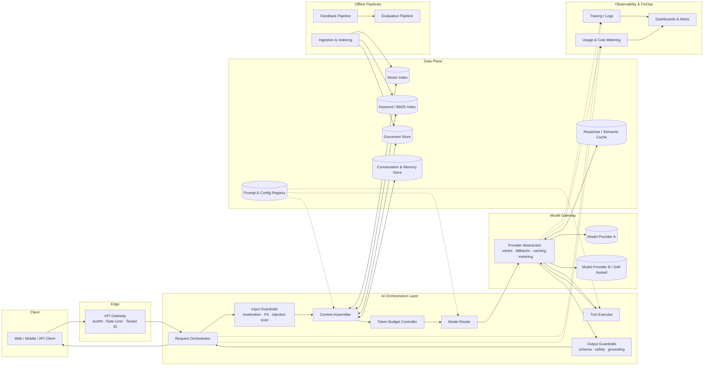
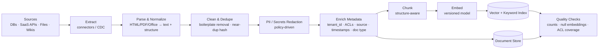

# Architecture Blueprint: AI Systems

The reference architecture for AI-powered systems. It covers data pipelines, context ingestion and context strategy, and strict token budget controls.

**How to use this document**

- It serves as both the **reference architecture** and the **template** for feature-level designs. Copy it to `ARCH-<feature-name>.md`, replace the `[placeholders]`, and link it from the PRD (`01_product_strategy/PRD_TEMPLATE.md` §9).
- The design is **provider-agnostic**. Record specific model names, context-window sizes, and prices in §5.2 and in ADRs, because those values change often.
- Store API schemas (OpenAPI, JSON Schema, tool definitions) in `02_tech_architecture/schemas/` and version them with the design.

---

## 0. Document Control

| Field | Value |
|---|---|
| Design ID | ARCH-[feature-name] |
| Status | Draft · In Review · Approved · Implemented · Superseded |
| Linked PRD | [PRD-YYYY-NNN] |
| Authors | [Names] |
| Reviewers | [Eng, ML, Security, SRE, FinOps] |
| Last Updated | [YYYY-MM-DD] |

---

## 1. Architecture Principles

1. **The model is a dependency, not the system.** Every model call goes through one gateway, so models can be swapped, pinned, and rolled back without changing product code.
2. **Context is a budgeted resource.** Each token in a prompt must justify its cost, latency, and effect on quality.
3. **Deterministic first.** Use code for validation, routing, math, and permission checks. Use models only for work that needs language understanding.
4. **Everything is versioned.** Prompts, tool definitions, retrieval configs, model IDs, and eval datasets are versioned artifacts, and each request logs which versions it used.
5. **Least privilege for AI.** Retrieval is scoped to the tenant and user. Tools get the narrowest permissions possible, and write actions require explicit authorization.
6. **Degrade gracefully.** Every AI path has a defined fallback for timeouts, budget exhaustion, or provider outages.
7. **Observable by default.** You should be able to trace any output back to its inputs, retrieved context, model, and cost.

---

## 2. System Overview

### 2.1 Reference Architecture



### 2.2 Component Responsibilities

| Component | Responsibility | Owner | Tech Choice |
|---|---|---|---|
| API Gateway | Authentication, tenant resolution, coarse rate limiting, request IDs | Platform | [ ] |
| Request Orchestrator | Runs the request lifecycle and manages agent/tool loops and streaming | AI Eng | [ ] |
| Input Guardrails | Moderation, PII detection/redaction, prompt-injection heuristics | Trust & Safety | [ ] |
| Context Assembler | Builds the prompt from system instructions, memory, retrieval, and tool results | AI Eng | [ ] |
| Token Budget Controller | Counts tokens before the call, enforces per-request and aggregate budgets, applies truncation policy | AI Platform / FinOps | [ ] |
| Model Router | Chooses model tier by task, complexity, budget, and health | AI Platform | [ ] |
| Model Gateway | Unifies the provider API; handles retries, fallback, caching, and usage metering | AI Platform | [ ] |
| Tool Executor | Validates arguments, enforces permissions, runs tools in a sandbox, caps result size | AI Eng | [ ] |
| Output Guardrails | Schema validation, safety filtering, citation/grounding checks, PII scan | Trust & Safety | [ ] |
| Prompt & Config Registry | Versioned prompts, tool schemas, routing rules, and budget policies | AI Platform | [ ] |

### 2.3 Request Lifecycle

1. **Receive:** Authenticate, resolve tenant and user, assign `request_id`, load the feature config version.
2. **Screen input:** Moderate the input and detect PII and injection attempts. Reject or sanitize.
3. **Check cache:** Look up an exact or semantic response-cache hit. Return early if one is found.
4. **Assemble context:** Gather system prompt, memory, retrieved documents, and tool definitions.
5. **Enforce budget:** Count tokens and apply the truncation or compaction policy (§4.6). Check aggregate budgets (§5).
6. **Route:** Choose a model based on task type, complexity score, remaining budget, and provider health.
7. **Invoke:** Stream from the model through the gateway, running the tool loop if needed and within step and token limits.
8. **Screen output:** Validate the schema, check safety and grounding, and scan for PII.
9. **Respond:** Stream to the client with citations and metadata.
10. **Record:** Emit the trace, token usage, cost attribution, and versions used. Enqueue for feedback and eval sampling.

---

## 3. Data Pipelines

### 3.1 Pipeline Inventory

| Pipeline | Mode | Trigger | Freshness SLA | Output | Owner |
|---|---|---|---|---|---|
| Knowledge ingestion | Batch + CDC stream | Source change events / nightly full sync | [≤ 1 hr] | Chunks, embeddings, keyword index | Data Eng |
| Conversation memory | Streaming | End of each turn / session | [≤ 1 min] | Summaries, extracted facts | AI Eng |
| Usage & cost metering | Streaming | Every model call | [≤ 5 min] | Token/cost ledger | AI Platform |
| Feedback collection | Streaming | User feedback events | [≤ 15 min] | Labeled interaction records | Product Analytics |
| Evaluation | Batch | Pre-deploy (CI) + nightly + on config change | Per run | Eval scores, regression reports | ML Eng |
| Deletion propagation | Event-driven | User/tenant deletion request | [≤ 24–72 hrs, per policy] | Purged indexes, caches, logs | Data Eng / Privacy |

### 3.2 Ingestion & Indexing Pipeline



**Stage requirements**

| Stage | Requirements |
|---|---|
| Extract | Incremental sync via change data capture or modified timestamps; checkpointing so jobs can resume; back-pressure handling |
| Parse | Keep document structure (headings, tables, lists) because chunking and citations depend on it |
| Clean / Dedupe | Content hashing so unchanged docs aren't re-embedded; drop low-information chunks |
| Redact | Apply the PII policy before embedding. Embeddings of sensitive text count as sensitive data. |
| Enrich | **Every chunk carries `tenant_id` and ACL metadata.** Retrieval filters on them at query time with no exceptions. |
| Chunk | See §3.3 |
| Embed | Record the embedding model and version on each vector. Changing models requires a full re-index with blue/green cutover. |
| Quality | Fail the pipeline if ACL coverage is under 100% or the embedding error rate is above [X]% |

### 3.3 Chunking Strategy

| Content Type | Strategy | Target Size | Overlap | Notes |
|---|---|---|---|---|
| Long-form docs / wikis | Split on headings, then paragraphs | [400–800 tokens] | [10–15%] | Prepend the heading path (breadcrumb) to each chunk |
| FAQs / KB articles | One Q&A pair per chunk | Natural | None | Keeps answers atomic |
| Tables | Row groups with repeated header | [ ] | None | Never split a row |
| Code | By function/class (AST-aware) | [ ] | None | Include file path and signature |
| Transcripts / chat | By speaker turn windows | [ ] | [1–2 turns] | Keep speaker and timestamp metadata |

### 3.4 Data Governance

- **Lineage:** Each chunk links back to `source_id`, `source_version`, `ingested_at`, `pipeline_version`.
- **Retention:** [Raw source N days · Indexes: life of source · Prompt/response logs N days · Eval datasets: indefinite with PII scrubbed]
- **Residency:** Indexes and logs stay in [region(s)], and model calls go to providers in approved regions.
- **Right to delete:** A deletion event purges the document store, vector index, keyword index, response cache, memory store, and logs, in that order. Verify the result with a post-purge query.

### 3.5 Context Ingestion Strategies

Content reaches a model's context in one of six ways. Pick a strategy for each data source; most features combine two or three.

| Strategy | How It Works | Best For | Freshness | Token Cost | Main Risks |
|---|---|---|---|---|---|
| **Static injection** | Fixed content in the versioned system prompt | Policies, style rules, product facts that rarely change | Per prompt release | Fixed on every call (cacheable) | Goes stale between releases; bloats every request |
| **Pre-indexed retrieval (RAG)** | Offline pipeline (§3.2) chunks and indexes; relevant chunks retrieved per query | Large, slowly changing knowledge bases | Pipeline freshness SLA | Scales with `final_k` | Retrieval misses; stale index; chunks split meaning |
| **Just-in-time retrieval** | Model calls search and read tools during the task and pulls only what it needs | Exploratory or multi-hop tasks, codebases, unpredictable corpora | Live | Variable, grows per step | Runaway loops; latency; requires step and token caps (§4.4) |
| **Live structured lookup** | Tool, API, or SQL call returns specific records at request time | Account data, orders, inventory, metrics | Real-time | Low when results are projected to needed fields | Permission scoping; oversized payloads |
| **User-supplied content** | Files, pastes, images, or URLs provided in the session | Ad hoc analysis of the user's own material | Session | Unbounded unless capped | Prompt injection; PII; exceeds context limits |
| **Full-document loading** | Entire document(s) placed in context | Short documents where reasoning across sections matters | Request | High | Cost and latency; quality can drop on very long inputs |

**Selection guide**

```text
Small (< [N] tokens), stable, and needed on nearly every request?  → Static injection
Structured, record-level, or must be real-time?                     → Live structured lookup
Provided by the user this session?                                  → User-supplied content
    └─ Over the per-source cap?                                     → Session-scoped index + retrieval
Large corpus, and relevant content is predictable from the query?   → Pre-indexed retrieval
Exploratory or multi-hop task?                                      → Just-in-time retrieval (capped)
Short document and the task needs all of it?                        → Full-document loading
```

**Ingestion rules (apply to every strategy)**

| Rule | Requirement |
|---|---|
| Trust labeling | Tag each item `trusted` (system-authored) or `untrusted` (user, retrieved, tool, web) and delimit it accordingly (§4.2, §7) |
| Access checks | Check permissions for the requesting user when content enters context, not only at indexing time |
| Projection | Tool and API results include only the fields the task needs; strip internal IDs, blobs, and markup |
| Normalization | Convert HTML, PDF, and Office files to clean text or Markdown; drop navigation, boilerplate, and base64 |
| Per-source caps | Each source has a per-request token cap enforced by the Token Budget Controller (§5.3) |
| Provenance | Each item carries `source_id`, `source_type`, `retrieved_at` so outputs can cite it |
| User uploads | Scan for malware and PII and count tokens on upload; if over the cap, index into a session-scoped store instead of injecting the whole file |
| Session-scoped indexes | Deleted at session end or after [N] hours; never merged into tenant-wide indexes |

---

## 4. LLM Context Strategy

### 4.1 Context Window Anatomy & Allocation

Treat the context window as a fixed budget and give each section an explicit allocation. Order the sections from **most stable to most dynamic** so the prompt-prefix cache hits as often as possible (§4.5).

| Order | Section | Stability | Budget (% of usable input) | Overflow Policy |
|---|---|---|---|---|
| 1 | System instructions & policies | Static per version | [5–10%] | Never truncate; fail at build time if over |
| 2 | Tool / function definitions | Static per version | [5–15%] | Load only the tools relevant to the route |
| 3 | Few-shot examples | Static per version | [0–10%] | Drop lowest-ranked examples |
| 4 | Long-term memory / user profile | Slow-changing | [0–5%] | Keep top-N facts by relevance |
| 5 | Retrieved context (RAG) | Per request | [30–50%] | Reduce top-k, then compress chunks |
| 6 | Conversation history | Per turn | [15–30%] | Summarize older turns (§4.3) |
| 7 | Tool results (agent loops) | Per step | [10–20%] | Truncate or summarize large payloads |
| 8 | Current user message | Per request | [≤ 10%] | Reject or ask the user to narrow if over the cap |
| — | **Reserved output tokens** | — | Set explicitly | Never borrowed by input sections |

> **Usable input** = model context limit − reserved output tokens − safety margin ([5]%). Using a smaller context than the maximum is often better: long, noisy contexts can lower answer quality and always cost more and add latency.

### 4.2 Retrieval Strategy (RAG)

| Stage | Default | Tunable Parameters |
|---|---|---|
| Query understanding | Rewrite the query using conversation context; split multi-part questions | Rewrite model tier, max sub-queries |
| Candidate retrieval | **Hybrid:** vector similarity plus keyword/BM25, merged with reciprocal rank fusion | `k_vector`, `k_keyword`, fusion weights |
| Access filtering | Pre-filter on `tenant_id` and ACLs **inside the index query**, never after retrieval | — |
| Reranking | Cross-encoder or model-based reranker on merged candidates | `rerank_top_n`, score threshold |
| Selection | Take top-k above the relevance threshold, dedupe near-duplicates, and diversify sources | `final_k`, `min_score`, max chunks per source |
| Packing | Order by relevance; wrap each chunk in delimiters with source ID and metadata | Format template version |
| No-result behavior | Tell the model explicitly that no relevant context was found; follow the PRD refusal policy | — |

**Context formatting convention**

```text
<retrieved_documents>
  <document id="doc_123" source="Support KB" updated="2026-08-02" title="Refund Policy">
  ...chunk text...
  </document>
</retrieved_documents>
```

Retrieved content is **data, not instructions**. The system prompt must say so, and the model must never follow instructions that appear inside retrieved documents or tool results (§7).

### 4.3 Conversation Memory Strategy

| Tier | Mechanism | Scope | When Used |
|---|---|---|---|
| Working memory | Last N turns verbatim | Session | Always, within the history budget |
| Compacted history | Rolling summary of older turns, regenerated every [N] turns or when history exceeds [X] tokens | Session | Long conversations |
| Episodic memory | Stored summaries of past sessions, retrieved by relevance | User | Returning users, when enabled |
| Semantic memory | Extracted durable facts and preferences, user-visible and user-editable | User | Personalization, when the user opts in |

**Compaction rules**
- Keep the verbatim text of the current task's goal, constraints the user stated, and unresolved questions.
- Replace large tool outputs with short summaries plus a reference ID that can be re-fetched.
- Store summaries with `summarized_turn_range` and `summary_model_version` so they can be audited.

### 4.4 Agentic / Tool-Use Context Controls

| Control | Default | Purpose |
|---|---|---|
| Max agent steps per request | [10] | Prevents runaway loops |
| Max tool result size inserted into context | [2,000 tokens] | Oversized results are truncated with a notice or stored and referenced |
| Dynamic tool loading | Route-scoped tool subsets | Fewer tokens and better tool selection |
| Parallel tool calls | Enabled where tools are read-only and independent | Latency |
| Write / irreversible tools | Require a confirmation step (per PRD autonomy level) | Safety |
| Sub-agent isolation | Sub-tasks run in fresh contexts and return only condensed results | Keeps the main context lean |

### 4.5 Caching Strategy

| Cache Type | What's Cached | Key | TTL | Invalidation |
|---|---|---|---|---|
| **Prompt-prefix cache** (provider-side) | Stable prompt prefix: system prompt, tools, few-shots | Provider-managed, prefix match | Provider-defined | Any byte change in the prefix |
| Exact response cache | Full response for identical normalized requests | Hash of (prompt version, model, normalized input, context hash) | [N hrs] | Prompt/model version change, source doc update |
| Semantic response cache | Responses for semantically equivalent queries | Embedding similarity ≥ [threshold] + tenant scope | [N hrs] | Same as above; **disable for personalized or time-sensitive answers** |
| Retrieval cache | Retrieval results for a query | Hash of (query, filters, index version) | [N min] | Index update |
| Embedding cache | Query embeddings | Hash of (text, embedding model version) | [N days] | Embedding model change |

**Prefix-cache hygiene:** Don't put timestamps, request IDs, or per-user data in the static prefix. Keep tool definitions in a deterministic order. Put dynamic content after the cache breakpoint.

### 4.6 Context Overflow Policy (Priority Order)

When the assembled context exceeds the usable input budget, apply these steps in order until it fits:

1. Drop retrieved chunks below the relevance threshold.
2. Reduce retrieval `final_k` stepwise down to a floor of [3].
3. Compress remaining chunks (extractive: keep only sentences relevant to the query).
4. Summarize conversation history beyond the last [N] turns.
5. Summarize or truncate tool results.
6. Drop few-shot examples.
7. Route to a model tier with a larger context window, if policy and budget allow.
8. **Fail gracefully:** ask the user to narrow the request. Never silently truncate the user's current message or the system instructions.

Log every overflow action with the step reached so the policy can be tuned.

### 4.7 Prompt Management

- Prompts live in the **Prompt & Config Registry**, not in application code.
- Versions are immutable, and each prompt version is pinned to a model version it has been evaluated against.
- Releasing a prompt requires passing the regression eval suite (§9) and is rolled out behind a flag or percentage split.
- Each request logs `prompt_id@version`, `model_id@version`, `retrieval_config@version`, `tool_schema@version`.

---

## 5. Token Budget Management Controls

### 5.1 Budget Hierarchy

Budgets are enforced top-down. A request proceeds only if **every level** has capacity.

```text
Organization (monthly $ cap)
 └── Environment (prod / staging / dev)
      └── Tenant / Customer (per plan tier)
           └── Feature / Use Case
                └── User
                     └── Session
                          └── Request (input + output + agent steps)
```

| Level | Budget Unit | Window | Enforcement | Default Limit |
|---|---|---|---|---|
| Organization | USD | Calendar month | Hard cap with executive override | [$ ] |
| Environment | USD | Month | Hard cap; non-prod caps are strict | prod [$ ], staging [$ ], dev [$ ] |
| Tenant | Tokens or USD | Month / day | Per plan tier; soft cap then degrade | [per tier table] |
| Feature | USD | Day | Soft cap with alert, hard cap at [X]% | [$ ] |
| User | Tokens | Day / hour | Hard cap (anti-abuse) | [N tokens] |
| Session | Tokens | Session | Triggers compaction or a new session prompt | [N tokens] |
| Request | Tokens | Request | Hard limits (§5.3) | [N in / N out] |

### 5.2 Model Tier Catalog

> Keep this table current. Review it monthly and whenever a provider announces changes or deprecations. Route-to-model assignments and selection rationale are recorded in PRD §9.

| Tier | Intended Use | Model ID (pinned) | Context Limit | Max Output | Input $/1M | Output $/1M | Cached Input $/1M |
|---|---|---|---|---|---|---|---|
| Small / Fast | Classification, routing, extraction, query rewrite, summarization | [ ] | [ ] | [ ] | [ ] | [ ] | [ ] |
| Medium / Balanced | Most generation and RAG Q&A | [ ] | [ ] | [ ] | [ ] | [ ] | [ ] |
| Large / Frontier | Complex reasoning, multi-step agents, high-stakes outputs | [ ] | [ ] | [ ] | [ ] | [ ] | [ ] |
| Embedding | Indexing and query embeddings | [ ] | [ ] | — | [ ] | — | — |

### 5.3 Per-Request Controls

| Control | Mechanism | Default |
|---|---|---|
| Pre-flight token count | Count tokens with the target model's tokenizer or count endpoint **before** the call | Required |
| Max input tokens | Enforced by Context Assembler + overflow policy (§4.6) | [N] |
| Max output tokens | Always set explicitly per route. Never rely on provider defaults. | [N] per route |
| Reasoning / thinking budget | Explicit cap where the model supports extended reasoning | [N] per route |
| Max agent steps | Hard stop plus a partial-result response | [10] |
| Cumulative request token ceiling | Sum across all steps in an agent loop | [N] |
| Timeout | Per model call and end-to-end | [N s] / [N s] |
| Max retries | Only for retryable errors; retry tokens count toward the budget | [2] |
| Estimated cost check | `est_cost` from pre-flight must be ≤ remaining budget at every level | Required |

**Cost estimation formula**

```text
est_cost = (uncached_input_tokens × input_rate)
         + (cached_input_tokens   × cached_input_rate)
         + (max_output_tokens     × output_rate)          # worst case for admission control
actual_cost = metered from provider usage response        # used for the ledger
```

### 5.4 Rate Limiting & Concurrency

| Limit | Scope | Algorithm | Purpose |
|---|---|---|---|
| Requests per minute | User, tenant | Token bucket | Abuse protection, fairness |
| Tokens per minute | Tenant, feature | Sliding window | Stay within provider quotas |
| Concurrent streams | User, tenant | Semaphore | Protect latency for everyone |
| Provider quota headroom | Global per provider/model | Adaptive, driven by provider rate-limit headers | Avoid provider-side throttling |
| Priority queues | Interactive > background > batch | Weighted fair queue | Batch jobs never starve interactive traffic |

Route non-urgent work (evals, backfills, bulk summarization) to **batch / asynchronous APIs** where available. They are usually cheaper and use separate quotas.

### 5.5 Model Routing & Cost Optimization

| Technique | Description | Expected Impact |
|---|---|---|
| Task-based routing | Map each route to its cheapest adequate tier based on eval results | High |
| Cascade / escalation | Try a smaller tier first, and escalate if confidence, validation, or the judge check fails | Medium–High |
| Prompt-prefix caching | Stable prefix ordering (§4.5) | High for long system prompts or tool sets |
| Response caching | Exact and semantic caches (§4.5) | Depends on query repetition |
| Context minimization | Tighter retrieval thresholds, compaction, dynamic tool loading | Medium |
| Output shaping | Structured output, concise style instructions, explicit max tokens | Medium |
| Batch processing | Async APIs for offline workloads | High for eligible workloads |

**Routing decision inputs:** task type · input size · complexity score · tenant plan tier · remaining budget at each level · provider health and latency · data residency constraints.

### 5.6 Degradation Ladder

When a budget threshold is crossed, degrade in steps rather than failing hard:

| Threshold (of budget window) | Action | User-Visible? |
|---|---|---|
| 50% | Alert the budget owner (informational) | No |
| 75% | Alert; enable aggressive caching and tighter retrieval `final_k` | No |
| 90% | Route medium-tier traffic to the small tier where evals allow; pause non-critical batch jobs | Minimal |
| 100% (soft cap) | Interactive: small tier only, shorter max output. Background: queued until the window resets. | Yes, show a notice |
| Hard cap | Block new AI requests for that scope, show the fallback UX, page on-call if the scope is org or prod | Yes |

**Kill switches:** A feature flag for each feature and each tenant disables AI calls immediately. Target time-to-disable is under [5 minutes].

### 5.7 Cost Attribution & Reporting

Tag every model call with:

```json
{
  "request_id": "req_...",
  "trace_id": "...",
  "org_id": "...",
  "environment": "prod",
  "tenant_id": "...",
  "user_id_hash": "...",
  "feature": "support_assistant",
  "route": "rag_answer",
  "model_id": "...",
  "prompt_version": "support_answer@14",
  "input_tokens": 0,
  "cached_input_tokens": 0,
  "output_tokens": 0,
  "reasoning_tokens": 0,
  "agent_step": 1,
  "cache_hit": "none | prefix | exact | semantic",
  "cost_usd": 0.0,
  "latency_ms": 0,
  "outcome": "success | fallback | error | blocked_budget"
}
```

**Standard reports**

| Report | Audience | Cadence |
|---|---|---|
| Spend vs. budget by org / env / feature | Finance, Eng leadership | Weekly |
| Cost per successful task by feature | Product, AI Eng | Weekly |
| Top tenants and users by token consumption | Account management, Trust & Safety | Weekly |
| Cache hit rates and savings | AI Platform | Weekly |
| Overflow and degradation events | AI Eng | Weekly |
| Forecast vs. actual (next 30/90 days) | Finance | Monthly |

### 5.8 Strict Enforcement Rules

These rules are what make the controls above strict. Any exception needs an approved, time-boxed override.

| # | Rule | Implementation |
|---|---|---|
| E1 | **No unbounded calls.** Every model call sets an explicit max output, timeout, and (for agents) step and cumulative token limits. | Model Gateway rejects calls that are missing any limit; CI lints route configs for them. |
| E2 | **Reserve before spending.** Admission control atomically reserves `est_cost` (§5.3) against every budget level before the call, then reconciles to `actual_cost` afterwards. | Budget ledger with atomic reserve / commit / release, so concurrent requests can't overspend. |
| E3 | **Fail closed.** If the budget ledger or metering is unavailable, new requests are limited to [small tier, ≤ N tokens] or blocked, never left unlimited. | Health-checked circuit breaker on the ledger. |
| E4 | **The gateway is the only path.** Application code may not call provider APIs directly. | Only the gateway holds provider keys; egress rules block provider endpoints for all other services. |
| E5 | **Hard caps in non-prod.** Dev and staging have hard caps with no soft-cap phase. | Separate provider keys or projects per environment. |
| E6 | **Everything counts.** Tokens from retries, fallbacks, sub-agents, and guardrail/judge calls are charged to the originating request. | Budget context propagated with `request_id` through every call. |
| E7 | **Overrides expire.** Budget increases need a named approver, a reason, and an expiry date of at most [30] days. | Override records in the config registry; limits revert automatically at expiry. |
| E8 | **Audit every override and block.** | Audit log records who, scope, old and new limit, reason, and expiry. |
| E9 | **Anomalies throttle automatically.** A spend spike above [X]× baseline for a tenant or user applies the §5.6 90% step until reviewed. | Anomaly detection on the cost ledger. |

**Budget override request**

| Field | Value |
|---|---|
| Scope (level + ID) | [ ] |
| Current / requested limit | [ ] / [ ] |
| Business justification | [ ] |
| Expiry date | [YYYY-MM-DD] |
| Approvers | [Budget owner + FinOps] |

---

## 6. Reliability & Resilience

| Concern | Control |
|---|---|
| Provider outage | Multi-provider or multi-region fallback via the Model Gateway; fallback models must pass the same eval suite |
| Transient errors / rate limits | Exponential backoff with jitter; honor `retry-after`; circuit breaker per provider/model |
| Timeouts | Per-call and end-to-end timeouts; streaming heartbeat detection |
| Malformed output | Structured output / schema validation, one repair retry, then fallback |
| Model deprecation | Model IDs are pinned; track deprecation calendars; run migration evals before [N] days of the end-of-life date |
| Idempotency | Idempotency keys on tool calls with side effects; no duplicate writes on retry |
| Degraded mode | Fallback tiers and UX defined for every feature (per PRD §14) |

**SLOs**

| SLI | SLO |
|---|---|
| AI request success rate (non-budget-blocked) | [≥ 99.X]% |
| Time-to-first-token p95 | [≤ X ms] |
| End-to-end latency p95 | [≤ X s] |
| Guardrail false-block rate | [≤ X]% |

---

## 7. Security & Isolation

| Threat | Control |
|---|---|
| Direct prompt injection | Input screening; system prompt hierarchy; refusal of instructions to reveal or override policy |
| Indirect prompt injection (via documents, web, tool results) | Treat all retrieved or tool content as untrusted data; delimit it clearly; tool calls prompted by untrusted content need policy checks; no silent privilege escalation |
| Cross-tenant data leakage | Tenant filter enforced inside index queries; tenant-scoped caches; tests that try cross-tenant retrieval |
| Excessive agency | Least-privilege tool scopes; allowlisted actions; human confirmation for irreversible writes; per-tool rate limits |
| Sensitive data exfiltration | Output PII/secret scanning; egress restrictions on tools; block rendering of untrusted URLs/images |
| Secrets exposure | Provider keys kept in a secrets manager; never placed in prompts; rotated every [N] days |
| Supply chain | Approved model/provider list; vendor DPAs; pinned SDK versions |
| Denial of wallet | Budget hierarchy (§5.1), per-user caps, anomaly detection on token spikes |

---

## 8. Observability

### 8.1 Tracing
Every request produces a distributed trace with spans for guardrails, retrieval (with the retrieved doc IDs and scores), context assembly (with token counts per section), each model call, each tool call, and output validation.

### 8.2 Logging Policy
| Data | Logged? | Retention | Access |
|---|---|---|---|
| Request metadata, token counts, cost, versions | Always | [N days] | Engineering |
| Full prompts and responses | [Sampled X% / on error / opt-in tenants] | [N days] | Restricted, with audited access |
| PII | Redacted before logging | — | — |

### 8.3 Key Metrics & Alerts
| Metric | Alert Condition |
|---|---|
| Token spend rate | > [X]× trailing 7-day average for the same hour |
| Budget utilization | Thresholds per §5.6 |
| Error / fallback rate | > [X]% over 5 min |
| TTFT / latency p95 | > SLO for 10 min |
| Guardrail block rate | Sudden change > [X]% (may mean an attack or a broken filter) |
| Retrieval empty-result rate | > [X]% |
| Online quality signal (thumbs-down rate) | > [X]% over 24 hrs |
| Cache hit rate | Drop > [X] points (possible prefix-cache breakage) |

---

## 9. Evaluation Infrastructure

| Component | Description |
|---|---|
| Eval dataset registry | Versioned golden, adversarial, and regression sets, linked to PRD §7.5 and §10 |
| Eval runner | Runs suites against any (prompt, model, retrieval config) combination; runs in CI on every config change |
| Graders | Deterministic checks (schema, exact match, citation validity) plus LLM-as-judge graders calibrated against human labels |
| Retrieval evals | Recall@k, MRR, and context precision on labeled query → relevant-doc sets |
| Cost & latency evals | Each eval run reports tokens, cost per example, and latency, so quality/cost trade-offs are visible |
| Production sampling | [X]% of production traffic is scored asynchronously, and failures go into the regression set |
| Release gate | Deploys are blocked if any suite drops below its threshold or regresses beyond a set tolerance |

---

## 10. Architecture Decision Records (ADRs)

Record significant decisions in `02_tech_architecture/adr/NNNN-title.md`.

```markdown
# ADR-NNNN: [Decision Title]

- **Status:** Proposed | Accepted | Superseded by ADR-XXXX
- **Date:** YYYY-MM-DD
- **Deciders:** [Names]

## Context
[Problem, constraints, and forces at play.]

## Options Considered
1. [Option A] — pros / cons / est. cost
2. [Option B] — pros / cons / est. cost

## Decision
[What we chose and why.]

## Consequences
[Trade-offs accepted, follow-up work, and what would make us revisit this.]
```

**Typical ADRs for AI systems:** model provider selection · embedding model selection · vector store selection · chunking strategy · hybrid vs. pure vector retrieval · memory strategy · build vs. buy guardrails · self-hosted vs. API models · budget enforcement design.

---

## 11. Architecture Readiness Checklist

**Data**
- [ ] Every indexed chunk has `tenant_id` and ACL metadata; retrieval filters are tested
- [ ] PII redaction applied before embedding and logging
- [ ] Deletion propagation tested end-to-end
- [ ] Freshness SLAs are monitored

**Context**
- [ ] Ingestion strategy chosen and documented per data source (§3.5)
- [ ] Context allocation table (§4.1) filled in, with token counts measured on real traffic
- [ ] Overflow policy (§4.6) implemented and logged
- [ ] Static prompt prefix is cache-friendly; cache hit rate is monitored
- [ ] Prompts, tools, and retrieval configs are versioned in the registry

**Token Budget**
- [ ] Budgets configured at every level of the hierarchy (§5.1)
- [ ] `max_output_tokens` and agent step limits set explicitly on every route
- [ ] Degradation ladder and kill switches tested in staging
- [ ] Cost attribution tags emitted on 100% of model calls
- [ ] Budget alerts routed to named owners
- [ ] Gateway rejects calls without limits (E1); CI lint in place
- [ ] Atomic reserve/commit ledger load-tested under concurrency (E2)
- [ ] Fail-closed behavior verified with the ledger down (E3)
- [ ] Direct provider egress blocked outside the gateway (E4)

**Reliability & Security**
- [ ] Fallback model passes the eval suite
- [ ] Prompt-injection and cross-tenant tests pass
- [ ] SLOs defined, with dashboards and alerts live
- [ ] Threat model reviewed by Security

**Evaluation**
- [ ] Regression suite gates deploys in CI
- [ ] Production sampling feeds failures back into eval datasets
