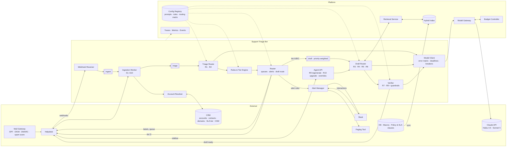
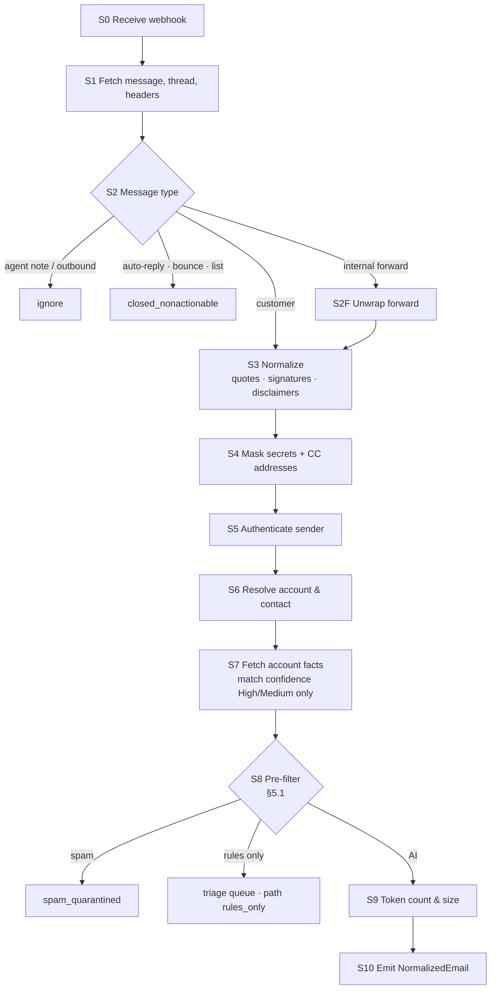
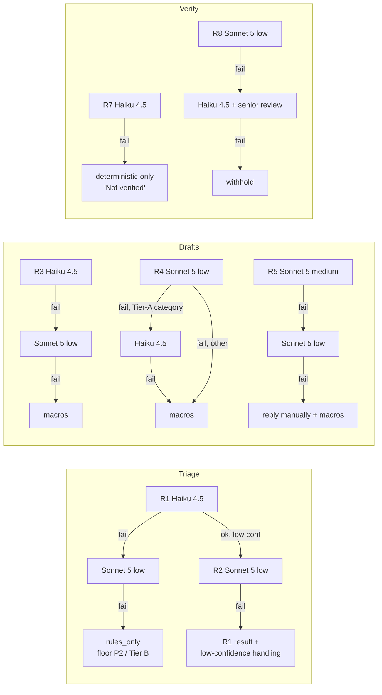

# ARCH: Support Triage Bot

System architecture for the Support Triage Bot. It covers:
- **Email ingestion:** how inbound corporate email is ingested and matched to accounts.
- **Model routing:** the thresholds that route work between Claude Haiku 4.5 and Claude Sonnet 5.
- **Error handling:** how every API error and fallback is handled.

**How this document relates to others**

- **Requirements:** `01_product_strategy/PRD_support_triage_bot.md` (PRD-2026-002). The PRD defines *what* and *why*; this document defines *how*. If they disagree, the PRD wins and this document is corrected.
- **Reference architecture:** `ARCHITECTURE_BLUEPRINT.md`. This design reuses its platform components (model gateway, token budget controller, prompt and config registry, retrieval service, eval harness) and documents only what's specific to this feature.
- **Replaces:** `archive/02_tech_architecture/ARCH_customer_support_triage.md`, which was written for superseded PRD-2026-001. This resolves PRD-2026-002 OQ-2.
- **Build plan:** `SPRINT_BACKLOG.md` (workspace root).

| This Doc | Blueprint |
|---|---|
| §3 Email Ingestion Pipeline | §3 Data Pipelines, §3.5 Context Ingestion |
| §4 Context Assembly & Request Configuration | §4 LLM Context Strategy, §5.3 Per-Request Controls |
| §5 Model Routing Thresholds | §5.5 Model Routing, §5.6 Degradation Ladder |
| §6 API Fallback & Error Handling | §6 Reliability & Resilience |
| §8 Token Budget Controls | §5 Token Budget Management Controls |
| §9 Security, Observability, Evaluation | §7–§9 |

---

## 0. Document Control

| Field | Value |
|---|---|
| Design ID | ARCH-support-triage-bot |
| Status | **Draft** · In Review · Approved · Implemented · Superseded |
| Linked PRD | PRD-2026-002 (`01_product_strategy/PRD_support_triage_bot.md`) |
| Authors | [Name, Engineering Lead] · [Name, Applied AI Lead] |
| Reviewers | [Eng] · [ML] · [Security] · [SRE] · [FinOps] · [Support Ops] |
| Last Updated | 2026-09-15 |

**Models:** `claude-haiku-4-5` (Claude Haiku 4.5) and `claude-sonnet-5` (Claude Sonnet 5), with `claude-opus-5` for offline evaluation only. The original request named Claude 3.5 Haiku and 3.5 Sonnet, which are retired (PRD OQ-1, ADR-0002).

**Threshold values in this document** are initial settings. Confidence thresholds are replaced by calibrated values after the Phase 0 bake-off (target 2026-10-09). Every threshold lives in `routing_config: bot@1` in the config registry and changes only through a reviewed config release that passes the regression suite (PRD §10.4).

---

## 1. Scope & Key Decisions

**In scope:** support mailboxes → ingestion and account resolution → triage (R1/R2) → rules → queue routing → Slack alerts and CSM DMs → tiered drafting (R3–R5) → verification (R7/R8) → agent workspace → feedback.

**Out of scope:** sending email (no permission), attachment content, non-email channels, account actions, CRM writes.

| # | Decision | Rationale |
|---|---|---|
| D1 | Fixed workflow; each model call is a single request with no tools | Untrusted email is the main attack surface; the model holds no capabilities |
| D2 | Models return JSON via structured outputs; code performs every side effect | A manipulated output can at worst mislabel a ticket, and rules and agents catch that |
| D3 | Account resolution is deterministic and runs **before** any model call | Account facts must never depend on model judgment |
| D4 | Rules run after triage and can only raise priority or risk tier | Critical signals don't depend on model accuracy alone |
| D5 | Triage and drafting run on separate queues | A slow Tier C draft never delays an urgent alert |
| D6 | The router owns all retries and fallbacks; SDK auto-retries are disabled | Retries stay inside each route's latency deadline and are counted against budgets |
| D7 | Every route has a deadline, and every fallback chain ends in a non-model outcome | No request can hang or loop; every failure has a defined user experience (PRD §14) |
| D8 | Shadow mode is a run mode on the same code path | Phase 1 results predict production behavior |

---

## 2. System Overview

### 2.1 Architecture Diagram



### 2.2 Components

| Component | Responsibility | Scales On |
|---|---|---|
| Webhook Receiver | Verify signature, dedupe, acknowledge ≤ 2 s, enqueue | Request rate |
| Ingestion Worker | Stages S1–S10 (§3.2) | `ingest` queue depth |
| Account Resolver | Deterministic account and contact matching (§3.3); 10-min cache | Ingestion throughput |
| Triage Router | Builds R1 request; decides R2 escalation (§5.2); merges results | `triage` queue depth |
| Rules & Tier Engine | Priority and tier floors; final tier (§5.3) | In-process |
| Router | Queue, Slack/CSM alerts, draft route selection (§5.4, §5.7) | Triage throughput |
| Draft Router | Retrieval, R3/R4/R5 request build, tier fallback chains (§6.5) | `draft` queue depth |
| Verifier | R7/R8 calls + deterministic guardrails; release or withhold (§5.5) | Draft throughput |
| Alert Manager | Post/thread/digest alerts; Claim/Not urgent; unclaimed → page | Alert rate (stateful: alert store) |
| Agent API | Assist payload, R9 regenerate and R10 upgrade (SSE), overrides, feedback | Agent requests |
| **Model Client** | Single wrapper for every Claude call: deadlines, error classification, retries, fallbacks, breakers, budget reservation, usage metering (§6) | Shared library |

### 2.3 Ticket Lifecycle

```text
received ─► normalized ─► ┬─ closed_nonactionable                       (auto-reply, bounce, list)
                          ├─ spam_quarantined
                          ├─ triaged (path = rules_only | ai_r1 | ai_r2 | manual_review)
                          │      │
                          │      ▼
                          │   routed ─► ┬─ alerted ─► claimed | escalated_to_page
                          │             ├─ tier_d_template_offered
                          │             └─ draft_pending ─► draft_ready | draft_ready_unverified
                          │                                  | draft_withheld | draft_failed | draft_skipped(reason)
                          └─ ingest_failed ─► manual_triage
```

Every transition emits an event (§7.3) carrying `ticket_id`, `message_id`, `trace_id`, `run_mode`, `config_bundle_id`, and route.

---

## 3. Email Ingestion Pipeline

### 3.1 Pipeline Inventory

| Pipeline | Mode | Trigger | Freshness SLA | Output |
|---|---|---|---|---|
| Email ingestion (§3.2) | Event-driven | Helpdesk `ticket.created`, `ticket.message_added` | Receipt → normalized ≤ 40 s p95 | `NormalizedEmail` on `triage` queue |
| Source indexing (§3.5) | Webhook + schedule | KB publish; macros hourly; policy/SLA clauses on merge; nightly reconcile | ≤ 1 hr | Hybrid index chunks |
| CRM domain cache | Scheduled | Every 15 min + on CRM account-domain change events | ≤ 15 min | Domain → account map for resolver |
| Feedback export | Batch | Weekly | Weekly | De-identified eval candidates |
| Usage metering | Streaming | Every model call | ≤ 5 min | Cost ledger by route and tier |
| Outage re-triage | On recovery | Breakers close | ≤ 30 min | Updated labels; late alerts if priority rises |
| Deletion propagation | Event-driven | Privacy request | ≤ 72 hrs | Purged records (§3.6) |

### 3.2 Ingestion Stages



| Stage | What It Does | Rules | Timeout / Retries | On Failure |
|---|---|---|---|---|
| **S0 Receive** | Validate and enqueue | HMAC-SHA256 signature, 5-min timestamp tolerance. Idempotency key `ticket_id:message_id` (7-day dedupe). `202` before processing. | 2 s | Bad signature → `401` + security log. Enqueue failure → `503` (helpdesk retries). |
| **S1 Fetch** | Message, thread (last 3 prior messages), raw headers, attachment names/types | Ordered per `ticket_id` (partitioned queue) | 5 s; 3 retries, backoff 1 s/4 s/16 s | DLQ + ticket tag `bot_ingest_failed` → `manual_triage` |
| **S2 Message type** | Classify | **Auto-reply/bounce:** `Auto-Submitted` ≠ `no`; `X-Autoreply`/`X-Autorespond`; `Precedence: bulk\|junk\|auto_reply`; empty `Return-Path`; delivery-status report. **List:** `List-Id` and sender not a CRM contact. **Internal forward:** From is an internal domain and body contains a forwarded-message block. **Agent/outbound:** author is internal helpdesk user. | — | Unknown → customer |
| **S2F Unwrap forward** | Recover original external sender | Parse forwarded header block (From/Date/Subject). The recovered sender is **unauthenticated** (the original signatures are lost), so S5 marks it `unverified`. | — | Can't parse → treat as internal; route to forwarder's queue; no draft |
| **S3 Normalize** | Clean text | Prefer `text/plain`, else HTML → text (drop script/style/images; keep link text + domain). UTF-8. Strip quoted history (`>` lines, "On … wrote:", Outlook header blocks). Strip signatures (`-- ` delimiter, contact blocks) and **legal disclaimers** (library of known footer patterns + trailing "confidential"/"intended recipient" paragraphs). Prior context from the thread API only. | 1 s | Parse error → tag-stripped raw text, `normalization_degraded` flag |
| **S4 Mask** | Remove secrets and third-party addresses | Typed tokens: `[CARD_NUMBER]` (13–19 digits, Luhn), `[BANK_ACCOUNT]` (IBAN/account patterns), `[SECRET]` (values next to password/passcode/OTP/code), `[API_KEY]` (known prefixes, high-entropy ≥ 32 chars), `[GOV_ID]` (per-country patterns), **`[CC_EMAIL]`** (every email address in To/CC other than the sender and support mailboxes, in headers and body). Counts only are stored. | 500 ms | **Stop.** Path `rules_only` (`masker_error`); unmasked text never reaches a model |
| **S5 Authenticate** | `sender_auth` | From `Authentication-Results`: `verified` = DMARC `pass`, or SPF `pass` and DKIM `pass` both aligned with the From domain. Otherwise `unverified`. | — | Header missing → `unverified` |
| **S6 Resolve account** | `account_id`, `contact_id`, `match_source`, `match_confidence` | See §3.3 | CRM 2 s | CRM timeout → `match_confidence: none`, flag `crm_unavailable` |
| **S7 Account facts** | Allowlisted CRM fields | Only when `match_confidence` ∈ {high, medium}. High: account + contact fields. Medium: account fields only. Fields: `tier`, `plan`, `arr_band`, `sla_tier`, `region`, `renewal_date`, `csm_user_id`, `open_escalations`; contact: `name`, `role`. | 2 s; 1 retry | Missing → continue without facts; flag `account_facts_missing` |
| **S8 Pre-filter** | Choose path | §5.1 | — | — |
| **S9 Token count & size** | Enforce input caps | Local estimate; if > 80% of R1 cap, confirm with the token-counting endpoint. Latest message > 8,000 tokens → first 6,000 + last 2,000 with `[… N tokens omitted …]`. Prior messages ≤ 3,000 tokens, newest first. | Count call 1 s | Count call error → local estimate × 1.2 |
| **S10 Emit** | Publish `NormalizedEmail` | Includes `config_bundle_id`, `run_mode`, `trace_id` | — | Retry, then DLQ |

### 3.3 Account & Contact Resolution

Evaluated in order; first match wins.

| Order | Match Source | Condition | `match_confidence` | Facts Passed to Models | Tier Effect |
|---|---|---|---|---|---|
| 1 | `verified_contact` | `sender_auth` = verified AND From address = active CRM contact on exactly one account | high | Account + contact | None |
| 2 | `existing_ticket` | Follow-up on a ticket already linked to an account AND From address appears on the ticket's prior messages AND `sender_auth` = verified | high | Account + contact (if contact exists) | None |
| 3 | `verified_domain` | `sender_auth` = verified AND From domain ∈ account's verified domains AND domain maps to exactly one account AND domain ∉ public-provider list | medium | Account only | Tier ≥ B |
| 4 | `ambiguous` | Anything else: unverified, public provider, domain on multiple accounts, contact on multiple accounts, CRM unavailable | none | None | Tier D (if unverified) or ≥ B |

- **Shared role addresses** (`ap@`, `it-help@`, `support@`, `admin@`) are never treated as contacts even if stored in the CRM. At best they resolve at order 3.
- **Contacts on multiple accounts** (e.g., resellers, agencies) resolve at order 4. The agent picks the account.
- **Agent overrides** of the account are written to the ticket and emitted as `account.overridden`. The resolver never writes to the CRM.

### 3.4 `NormalizedEmail` Record

`02_tech_architecture/schemas/normalized_email.v2.json` (folder created in Sprint 1)

```json
{
  "ticket_id": "string",
  "message_id": "string",
  "event_type": "ticket.created | ticket.message_added",
  "received_at": "RFC 3339",
  "run_mode": "live | shadow",
  "config_bundle_id": "string",
  "path": "ai | rules_only",
  "path_reason": "null | masker_error | kill_switch | rate_limited_sender | rate_limited_domain | budget_hard_cap | breakers_open",
  "subject": "masked string",
  "latest_message": "masked, normalized, possibly truncated",
  "prior_messages": [{ "author_role": "customer | agent", "text": "masked", "sent_at": "RFC 3339" }],
  "truncated": false,
  "thread_message_count": 0,
  "recipients": { "to_count": 0, "cc_count": 0, "external_domains_count": 0 },
  "sender_auth": "verified | unverified",
  "forwarded_by_internal": false,
  "account_match": { "account_id": "string | null", "contact_id": "string | null", "match_source": "verified_contact | existing_ticket | verified_domain | ambiguous", "match_confidence": "high | medium | none" },
  "account_facts": { "tier": "enterprise | business | self_serve", "plan": "string", "arr_band": "string", "sla_tier": "string", "region": "string", "renewal_date": "date", "csm_user_id": "string | null", "open_escalations": 0, "contact": { "name": "string", "role": "string" } },
  "attachments": [{ "filename": "string", "content_type": "string" }],
  "masking_counts": { "CARD_NUMBER": 0, "BANK_ACCOUNT": 0, "SECRET": 0, "API_KEY": 0, "GOV_ID": 0, "CC_EMAIL": 0 },
  "prior_triage": { "category": "string", "priority": "P1-P4", "tier": "A-D" },
  "flags": ["normalization_degraded", "crm_unavailable", "account_facts_missing"]
}
```

`account_facts` is `null` when `match_confidence` = none. `account_facts.contact` is `null` unless confidence is high.

### 3.5 Source Indexing

| Source | Chunking | Required Metadata | Retrieval Filter |
|---|---|---|---|
| KB articles (public) | Headings; 400–800 tokens; 10% overlap; heading path prepended | `source_id`, `title`, `url`, `language`, `product_area`, `updated_at` | `language` = ticket language |
| Macros | One per chunk | `source_id`, `category`, `language`, `updated_at` | `language`; category boost |
| Policy & SLA clauses | One clause per chunk | `source_id`, `applies_to_tiers[]`, `applies_to_sla_tiers[]`, `effective_from`, `effective_to` | Account `tier` and `sla_tier` match AND effective today |
| Tier D acknowledgement templates | Not indexed; loaded by `template_id` | `template_id`, `language`, `approved_by`, `approved_at` | Selected by category + language |

The index is hybrid (vector + BM25), with one index per language. Sync fails if any chunk lacks `source_id` or `updated_at`, or if more than 1% of embeddings fail.

### 3.6 Data Governance

| Data | Store | Retention |
|---|---|---|
| `NormalizedEmail` | Pipeline store | 30 days |
| Masked prompts and responses | Log store (restricted, audited) | 30 days |
| Trace metadata: routes, models, tokens, costs, thresholds, rules, errors | Tracing + warehouse | 13 months |
| Alert state, Slack messages, CSM DMs | Alert store + Slack | 90 days (store); Slack per workspace policy |
| Overrides, feedback | Warehouse | 13 months |
| Eval candidates | Eval registry | Indefinite after de-identification |

**Deletion order:** pipeline store → log store → alert store and Slack messages/DMs (`chat.delete`) → feedback rows → eval candidates not yet de-identified → verification query per store.

---

## 4. Context Assembly & Request Configuration

### 4.1 Context per Route

| Route | Cacheable Prefix (system) | Dynamic Content (user turn) | Input Cap | Output Cap |
|---|---|---|---|---|
| R1 Triage | Instructions, taxonomy, priority and tier definitions, injection guidance, 14 few-shots (~5,000 tokens) | Account facts, recipients summary, subject, latest message, prior messages | 17,000 | 1,024 |
| R2 Escalation | Same prefix as R1 (separate cache, different model) | Same as R1 + Haiku's result in `<first_pass>` block, marked as a hint that may be wrong | 17,000 | 2,000 |
| R3 Tier A draft | Haiku draft prompt: voice, rules, commitment rules, **10 few-shots (~4,500 tokens)** | Triage result, account facts, retrieved docs (top 6, ≤ 4,000), thread, latest message | 20,000 | 2,000 |
| R4 Tier B draft | Sonnet draft prompt (shared B/C): voice, rules, commitment rules, 6 few-shots (~3,000 tokens) | As R3 | 20,000 | 4,000 |
| R5 Tier C draft | Same prefix as R4 | As R3, with retrieved docs top 8 (≤ 5,500) + high-stakes instruction block in the user turn | 24,000 | 8,000 |
| R7 Verify A/B | Verifier rubric (~1,500 tokens, not cached) | Retrieved docs + draft JSON | 16,000 | 512 |
| R8 Verify C | Verifier rubric | Retrieved docs + draft JSON | 16,000 | 2,000 |
| R9 Regenerate / R10 Upgrade | Same prefix as the tier's route (R10 uses R4/R5 prefix) | Original context + agent instruction (≤ 300 tokens, authenticated agent) | Tier cap + 300 | Tier cap |

- **Delimiters:** customer content is wrapped in `<customer_email>`, and retrieved content in `<document source_id="…">`. Both system prompts state these are data, never instructions.
- **R5's high-stakes instructions go in the user turn** so R4 and R5 can share one cached prefix.

### 4.2 Prompt Caching

| Prefix | Model | Tokens | Minimum Cacheable | TTL | Guard |
|---|---|---|---|---|---|
| Triage (R1) | Haiku 4.5 | ~5,000 | 4,096 | 5 min | CI fails if < 4,300 tokens |
| Triage (R2) | Sonnet 5 | ~5,000 | 1,024 | 5 min | Sparse traffic (~10% of emails); hit rate assumed low and priced uncached |
| Tier A draft (R3) | Haiku 4.5 | ~4,500 | 4,096 | 5 min | CI fails if < 4,300 tokens |
| Tier B/C draft (R4/R5) | Sonnet 5 | ~3,000 | 1,024 | 5 min | Shadow mode must confirm cache reads across effort `low` and `medium` (PRD A-14); if not, give R5 its own prefix |
| Verifiers (R7/R8) | Both | ~1,500 | — | — | Not cached |

**Hygiene:** no timestamps, IDs, or names in system prompts; fixed few-shot order; one API workspace for all live traffic (caches are isolated per workspace); pre-warm each prefix with a `max_tokens: 0` request on worker boot and after deploys; alert if a route's cache-read share falls below 70% for 1 hour.

### 4.3 Request Parameters per Route

| Parameter | R1 | R2 | R3 | R4 | R5 | R7 | R8 | R9/R10 |
|---|---|---|---|---|---|---|---|---|
| `model` | `claude-haiku-4-5` | `claude-sonnet-5` | `claude-haiku-4-5` | `claude-sonnet-5` | `claude-sonnet-5` | `claude-haiku-4-5` | `claude-sonnet-5` | Per tier |
| `max_tokens` | 1,024 | 2,000 | 2,000 | 4,000 | 8,000 | 512 | 2,000 | Per tier |
| `thinking` | omitted | `{type: "adaptive"}` | omitted | `{type: "adaptive"}` | `{type: "adaptive"}` | omitted | `{type: "adaptive"}` | Per tier |
| `output_config.effort` | n/a | `low` | n/a | `low` | `medium` | n/a | `low` | Per tier |
| `output_config.format` | `triage_output.v2` | `triage_output.v2` | `draft_output.v2` | `draft_output.v2` | `draft_output.v2` | `verifier_output.v2` | `verifier_output.v2` | `draft_output.v2` |
| `temperature` | 0 | not sent | 0 | not sent | not sent | 0 | not sent | Per tier |
| Streaming | No | No | No | No | No | No | No | Yes |
| Attempt timeout | 10 s | 20 s | 20 s | 45 s | 90 s | 10 s | 20 s | 45 s / 90 s |

**Sonnet 5 constraints:**
- Sampling parameters and `budget_tokens` return `400`, so the Model Client strips them from Sonnet 5 requests.
- Assistant prefill is not supported.
- Structured outputs replace any JSON-forcing technique.

**Haiku 4.5:** `effort` is not supported, and thinking stays off on all Haiku routes.

**Startup check:** each worker calls the Models API for every configured model ID, and a model that isn't available fails readiness.

---

## 5. Model Routing Thresholds

All conditions are evaluated in the order listed, and the first match wins unless the table says otherwise.

### 5.1 Pipeline Path (S8)

| # | Condition | Path | Model Calls |
|---|---|---|---|
| P0 | S2 = auto-reply, bounce, or list | `closed_nonactionable` | None |
| P1 | Gateway spam score ≥ 8.0 AND sender not a CRM contact | `spam_quarantined` (2% daily audit) | None |
| P2 | Masker error (S4) | `rules_only` | None |
| P3 | `bot_ai_triage_enabled` = false | `rules_only` | None |
| P4 | Sender > 10 emails in 60 min | `rules_only` (`rate_limited_sender`) + one digest alert per hour | None |
| P5 | Domain > 200 emails in 60 min | `rules_only` (`rate_limited_domain`) + page on-call once | None |
| P6 | Triage route hard budget reached | `rules_only` (`budget_hard_cap`) | None |
| P7 | Breakers open for both R1 and its fallback model | `rules_only` (`breakers_open`) | None |
| P8 | Otherwise | `ai` | R1 (+ R2 per §5.2) |

**Rules-only classifier:** keyword and sender rules assign category where confident, otherwise `other`. Priority is the highest rule floor, minimum **P2**. Tier is the highest rule floor, minimum **B**. The ticket goes to `manual_triage` unless a rule set the category with high confidence.

### 5.2 Triage: Haiku (R1) vs. Sonnet (R2)

**Step 1: R1 runs on every `ai`-path email.**

**Step 2: escalate to R2 if any condition is true** (initial thresholds; replaced by calibrated values after bake-off):

| ID | Escalation Condition | Initial Threshold | Rationale |
|---|---|---|---|
| T1 | `confidence.category` below threshold | < 0.70 | Wrong category → wrong queue |
| T2 | `confidence.priority` below threshold | < 0.75 | Priority errors are the costliest |
| T3 | `confidence.tier` below threshold | < 0.70 | Tier drives draft model and spend |
| T4 | R1 priority ∈ {P1, P2} AND `confidence.priority` < 0.85 | 0.85 | Uncertain high-priority calls get a second opinion |
| T5 | R1 tier = A AND `confidence.tier` < 0.85 | 0.85 | Guards against under-tiering to the cheapest draft route |
| T6 | `thread_message_count` ≥ 6 AND `confidence.category` < 0.85 | 6 msgs / 0.85 | Long corporate threads are harder to summarize correctly |
| T7 | R1 returned `injection_suspected` = true | — | Confirm before withholding a draft (result still Tier D if either model flags it) |

**Skip R2 even if a condition above is true:**

| ID | Skip Condition | Reason |
|---|---|---|
| K1 | A Tier D rule already fired (§5.3 step 1), and T1–T6 are the only triggers | Tier D is final; no draft is generated |
| K2 | A rule already set priority P1 AND only T2/T4 triggered | Priority can't go higher; R1 labels proceed, R2 runs **asynchronously after** the alert posts to refine category and tier |
| K3 | `bot_triage_escalation_enabled` = false, R2 breaker open, or R2 route budget ≥ 100% | Go directly to step 4 low-confidence handling |
| K4 | Escalation share over the trailing 60 min > 20% of `ai`-path emails | Protects cost and latency during anomalies; R2 limited to T2/T4/T5/T7 until share < 15%; alert ML Lead |

**Step 3: merge R1 and R2 results.**

| Field | Merge Rule |
|---|---|
| `priority` | Higher of R1 and R2 |
| `risk_tier_suggestion` | Higher of R1 and R2 (A < B < C < D) |
| `churn_risk` | Higher of R1 and R2 (low < medium < high) |
| `category` (and its taxonomy value) | R2's category if `R2.confidence.category` ≥ 0.70; else R1's if R1 ≥ 0.70; else `needs_review` |
| `injection_suspected` | True if either is true |
| `summary`, `customer_requests`, `sentiment`, `language` | From R2 |
| `is_complaint`, `mentions_contract_terms` | True if either is true |
| `priority_reasons`, matched signals | Union of R1 and R2, so rules see every signal either model found |
| Category confidence | From the model whose category was kept (R2's if `needs_review`) |
| Priority and tier confidence | R2's values |
| Trace | Both raw results and a per-field merge-source map are stored |

Both payloads are validated before merging (enums, confidences within [0, 1], boolean flags, request count). An invalid R2 payload is treated as R2 unavailable: route on R1 with step 4 handling (§6.5). Reference implementation and tests: `03_operations_sprints/triage_router.py` (`merge_triage`) and `test_triage_router.py`.

**Step 4: low-confidence handling.** If after the merge (or when R2 was skipped under K3) category confidence is below 0.70 or priority confidence is below 0.75:
- `queue` = `manual_triage`
- `priority` ≥ P2 and `tier` ≥ B
- Both model suggestions are shown to the agent (PRD §14.2).

**Expected mix (to verify in shadow mode):** R2 on ~10% of emails (PRD A-13); manual triage on ≤ 3%.

### 5.3 Rules & Final Tier

**Step 1: Tier D floors** (any match → Tier D; also sets category where noted)

| Rule | Condition | Also Sets |
|---|---|---|
| D-SEC | Category `security_privacy` OR security keywords | Priority ≥ P1 if `sender_auth` = verified, else ≥ P2 |
| D-LEGAL | Category `legal_compliance` OR legal keywords ("attorney", "legal action", "breach of contract", "subpoena", "regulator", "GDPR request", "data subject request") | Priority ≥ P2 |
| D-SAFE | Safety keyword or moderation match | Priority P1; T&S queue |
| D-INJ | `injection_suspected` | Priority ≥ P3; QA flag |
| D-UNVER | `sender_auth` = unverified | — |
| D-FWD | `forwarded_by_internal` = true (original sender unauthenticated) | — |

**Step 2: Tier C floors**

| Rule | Condition |
|---|---|
| C-COMPLAINT | `is_complaint` = true |
| C-CHURN | `churn_risk` = high |
| C-CONTRACT | `mentions_contract_terms` = true OR category `contract_renewal` with any money/SLA keyword |
| C-PRIORITY | Final priority ∈ {P1, P2} |
| C-MULTI | `customer_requests` count ≥ 3 |
| C-THREAD | `thread_message_count` ≥ 5 |
| C-CANCEL | Category `cancellation` |

**Step 3: Tier B floors**

| Rule | Condition |
|---|---|
| B-MATCH | `match_confidence` ≠ high |
| B-NEG | `sentiment` = very_negative (not already C) |
| B-LANG | Language ∉ Haiku Tier A approved languages (initially EN, ES, FR, DE; JA pending bake-off) |
| B-LOWCONF | Manual review path (§5.2 step 4) |

**Step 4: Tier A eligibility.** Tier A is allowed only if **every** condition holds; otherwise the minimum tier is B.

| Condition | Value |
|---|---|
| Category | ∈ {`how_to`, `order_subscription`, `account_access`} AND no lockout keywords ("locked out", "can't access", "SSO down") |
| Priority | ∈ {P3, P4} |
| `confidence.tier` (after merge) | ≥ 0.85 |
| `match_confidence` | high |
| `customer_requests` | ≤ 2 |
| `thread_message_count` | ≤ 2 |
| `sentiment` | ∈ {neutral, positive} |
| `bot_drafts_tier_a_enabled` | true |

**Step 5: priority floors (business)**

| Rule | Condition | Effect |
|---|---|---|
| P-ENT-COMPLAINT | Enterprise AND `is_complaint` | ≥ P2 |
| P-ENT-CHURN | Enterprise AND `churn_risk` = high AND renewal ≤ 90 days | ≥ P1 |
| P-REPEAT | 3rd customer message within 72 hrs, unresolved | +1 level (max P1) |
| P-FOLLOWUP | Follow-up message | Priority and tier ≥ `prior_triage` |

**Resolve:** `final_tier` = max(model suggestion, all floors), with Tier A allowed only per step 4. `final_priority` = max(model priority, all floors). Rules never lower a value (property-based tests, §9.3). `rules_applied[]` is recorded on the ticket.

### 5.4 Tier → Draft Route

| Final Tier | Draft Eligibility (all required) | Route | Verifier |
|---|---|---|---|
| A | Common checks (below) + step 4 passed | **R3** Haiku 4.5 | R7 Haiku 4.5 |
| B | Common checks | **R4** Sonnet 5 `low` | R7 Haiku 4.5 |
| C | Common checks + `bot_drafts_tier_c_enabled` | **R5** Sonnet 5 `medium` | R8 Sonnet 5 `low` |
| D | — | **R6** no model; template by `template_id` for D-SEC/D-LEGAL; runbook link for D-SAFE; banner for D-INJ/D-UNVER/D-FWD | — |

**Common checks:**
- `run_mode` = live, or shadow drafting is enabled
- `bot_drafts_enabled` and the tier flag are on
- Category ≠ `spam`
- Language ∈ {EN, ES, FR, DE, JA}
- Ticket is open, with no agent reply after this message
- Route budget below its pause threshold (§5.6)

**If a check fails:** `draft_skipped` is recorded with the first failing reason, and the agent sees macros.

**Queue priority:** P1 → P2 → Tier C → others, in arrival order.

### 5.5 Verification & Release Thresholds

| Check | Tier A/B Threshold | Tier C Threshold | Action on Failure |
|---|---|---|---|
| Schema validation | Valid | Valid | Repair attempt (§6.4) |
| Source IDs ⊆ retrieved set | 100% | 100% | Remove unknown IDs; `unverified_sources` label |
| PII / masked-token leakage / other-recipient data | 0 | 0 | **Withhold** + security log |
| Banned phrases (per language) | 0 | 0 | Highlight as failed claim |
| Deterministic commitment scan ⊆ `commitments[]` | All listed | All listed | Add missing items (agent must confirm) |
| Verifier: unsupported policy/pricing/SLA claims | ≤ 1 → release with highlight; ≥ 2 → withhold | 0 → release; 1 → release with highlight; ≥ 2 → withhold | As stated |
| Verifier: contract interpretation detected | Withhold | Withhold | Withhold; flag QA |
| Verifier unavailable (§6.5) | Release as "Not verified" | Fallback to R7 + `senior_review_required` flag (send requires Tier 2 agent) | As stated |

### 5.6 Budget- and Latency-Driven Routing

Evaluated per route budget window (day, UTC) by the Budget Controller and read by the routers before each request.

| Signal | Threshold | Routing Change | Restored When |
|---|---|---|---|
| Feature daily spend | ≥ 75% of $150 soft cap | Retrieval top-k: A/B 6 → 4; C 8 → 6 | Next window |
| Feature daily spend | ≥ 90% | Tier A paused (macros); R5 effort `medium` → `low`; R2 limited to T2/T4/T5/T7 | Next window |
| Feature daily spend | ≥ 100% soft cap | Tier B paused; Tier C continues at `low` | Next window or approved override |
| Feature daily spend | ≥ $250 hard cap | All drafting paused; triage continues until triage route hard cap | Next window or approved override |
| Triage route monthly budget | ≥ 100% | Pipeline P6 → `rules_only` | Override or next month |
| R2 share of `ai` emails | > 20% trailing 60 min | K4 limits (§5.2) | < 15% for 30 min |
| Tier C share of drafts | > 25% for a day | Alert FinOps + ML (no routing change; investigate tier drift) | — |
| Receipt → alert p95 | > 120 s for 15 min | R2 fully async (K2 behavior for all P1/P2 candidates) | ≤ 90 s for 30 min |
| R5 draft p95 | > 150 s for 30 min | R5 effort `medium` → `low` | ≤ 110 s for 30 min |
| R3 (Haiku draft) error or timeout rate | > 10% for 15 min | Tier A → R4 | < 2% for 30 min (breaker probes) |

### 5.7 Queue, Alert & CSM Routing

**Queues** (first match wins):

| # | Condition | Queue |
|---|---|---|
| 1 | D-SAFE | `trust_safety` |
| 2 | Category `security_privacy` | `security_intake` |
| 3 | Category `legal_compliance` | `legal_privacy_intake` |
| 4 | Manual review path | `manual_triage` |
| 5 | Language without a language team in EN/ES/FR/DE/JA | `lang_other` |
| 6 | Enterprise tier | `enterprise_<category>` |
| 7 | Category ∈ {`billing`, `cancellation`, `contract_renewal`} | `billing_renewals` |
| 8 | Category `technical_issue` | `technical_<language>` |
| 9 | Otherwise | `general_<language>` |

**Slack and CSM alerts:**
- **Channels and mentions:** per PRD §6.4.
- **Suppression:** alerts are suppressed in shadow mode.
- **Threading:** a repeat alert for the same ticket within 30 min posts in the existing thread.
- **Digest:** more than 20 P1 alerts in 10 min switches to a digest and pages on-call.
- **Possible incident:** 5 or more P1 `technical_issue` tickets in 15 min whose summaries are similar (cosine similarity ≥ 0.85) produce a "possible incident" message.
- **Unclaimed:** an unclaimed P1 is paged to on-call after 15 min.
- **CSM DM:** sent when the account is Enterprise AND (P1 OR `is_complaint`) AND `csm_user_id` maps to a Slack user. The DM content is the same masked summary; no DM goes out if the CSM has opted out (PRD OQ-7).

---

## 6. API Fallback & Error Handling

### 6.1 Principles

1. **One Model Client.** Every Claude call goes through the Model Client library, and no service calls the SDK directly.
2. **The router owns retries.** SDK automatic retries are disabled (`max_retries = 0`). Otherwise a single attempt could silently take up to `timeout × 3` and blow the route deadline.
3. **Deadlines, not retry counts.** Each request has an end-to-end deadline. Every attempt gets `min(attempt timeout, remaining deadline)`, and no attempt starts with less than 2 s remaining.
4. **Classify, then act.** Each failure maps to exactly one class (§6.3–§6.4), and the class determines the action.
5. **Fall back across models, not just retries.** Haiku 4.5 and Sonnet 5 have separate rate limits and capacity, so a different model is usually the fastest recovery.
6. **Every chain ends in a non-model outcome:** rules-only triage, macros, template, or manual queue.
7. **Charge everything.** Retries and fallbacks reserve and consume budget on the originating ticket (blueprint §5.8 E6).
8. **Record the provider `request_id`** on every error for support escalation.

### 6.2 Client Configuration

| Setting | Value |
|---|---|
| SDK `max_retries` | `0` |
| SDK request timeout | Set per attempt from §4.3 (units per SDK: e.g., seconds in Python, milliseconds in TypeScript) |
| Connection pool | Per model; max concurrency per model from rate-limit tier (OQ-A1) with 30% headroom |
| Adaptive concurrency | Reduce per-model concurrency by 25% on each `429`, recover +5% per minute without `429` |
| Rate-limit headers | Parse `retry-after` and rate-limit remaining headers on every response; publish to Budget Controller |
| Idempotency | Model calls have no side effects; duplicate calls cost money only. Draft jobs keyed by `ticket_id:message_id:route` and cancelled if a newer customer message arrives |

**Route deadlines**

| Route | End-to-End Deadline | Chain |
|---|---|---|
| R1 (+ R1 fallback) | 20 s | Haiku (10 s) → Sonnet `low` (remaining ≤ 10 s) → rules-only |
| R2 | 20 s | Sonnet `low` → (no model fallback) → merge using R1 only + low-confidence handling |
| R3 | 45 s | Haiku (20 s) → Sonnet `low` with R4 settings (remaining ≤ 25 s) → macros |
| R4 | 70 s | Sonnet `low` (45 s) → Haiku, Tier A categories only (remaining ≤ 20 s) → macros |
| R5 | 135 s | Sonnet `medium` (90 s) → Sonnet `low` (remaining ≤ 45 s) → manual ("High-stakes: reply manually") + macros |
| R7 | 12 s | Haiku (10 s) → deterministic checks only, "Not verified" |
| R8 | 32 s | Sonnet `low` (20 s) → Haiku with R7 settings (remaining ≤ 10 s) + `senior_review_required` → withhold |

Deadlines longer than the PRD §15.1 draft targets apply only on the failure path. The happy path must still meet the PRD's p95 targets.
| R9 / R10 | 45 s / 90 s | Same chain as tier; on failure keep previous draft |
| R11 / R12 (batch) | Batch SLA | §6.8 |

### 6.3 HTTP Error Matrix

Applies to every live route. "Fallback" means the next model in the route's chain (§6.2).

| Status | Error Type | Class | Same-Model Retry | Then | Breaker Impact | Alert |
|---|---|---|---|---|---|---|
| `400` | `invalid_request_error` | **Config** | No | If the message names a model-specific parameter (e.g., sampling or thinking settings) → fallback model and page (config bug). Otherwise → end of chain (rules-only / macros). | Separate counter: ≥ 5 in 5 min → freeze config bundle, auto-rollback to previous bundle | Page AI Platform |
| `401` | `authentication_error` | **Credential** | No | End of chain for **all** routes (all models share the credential) | Opens all breakers | Page AI Platform + Security (immediate) |
| `402` | `billing_error` | **Account** | No | End of chain for all routes | Opens all breakers | Page AI Platform + FinOps |
| `403` | `permission_error` | **Access** | No | Fallback model (access may be model- or region-specific); if also `403` → end of chain | Opens breaker for that model | Page AI Platform |
| `404` | `not_found_error` | **Model unavailable** | No | Fallback model; mark model unavailable in catalog until readiness check passes | Opens breaker for that model | Page AI Platform; start lifecycle review (PRD §9.6) |
| `413` | `request_too_large` | **Size** | No | Re-run S9 sizing with caps × 0.6, one attempt on same model; then end of chain | None | Ticket metric; alert if > 0.1% |
| `429` | `rate_limit_error` | **Throttle** | Once, if `retry-after` ≤ route budget (R1/R7: 2 s; R2/R8: 3 s; R3/R4: 5 s; R5: 10 s) and deadline allows | Fallback model; reduce concurrency (§6.2) | Counts toward breaker only if `retry-after` > 30 s | Alert if 429 share > 5% for 10 min |
| `500` | `api_error` | **Transient** | Once after 500–1,000 ms jittered backoff if ≥ 50% of deadline remains | Fallback model | Counts | Alert if > 2% for 10 min |
| `529` | `overloaded_error` | **Capacity** | R1/R2/R7: no. Drafts (R3–R5, R8): once after 2–4 s jittered backoff | Fallback model | Counts | Alert if > 2% for 10 min |
| Other `5xx` / gateway errors | — | **Transient** | As `500` | Fallback model | Counts | As `500` |
| Client timeout | — | **Timeout** | No (a timed-out call likely means a slow backend) | Fallback model | Counts | Alert on p95 per §5.6 |
| Connection error / reset / DNS | — | **Network** | Once immediately on a new connection | Fallback model | Counts | Alert if > 1% for 5 min |
| Streaming error mid-response (R9/R10) | — | **Stream** | No | Keep previous draft; show retry (PRD §14.2) | Counts | Metric |

### 6.4 Response-Level Handling (HTTP 200)

| Condition | Route(s) | Action |
|---|---|---|
| `stop_reason` = `end_turn` AND schema-valid AND business-valid | All | Success |
| `stop_reason` = `max_tokens` | R1/R2 | Retry once on same model with `max_tokens` × 2 (R1 2,048; R2 4,000); then fallback |
| `stop_reason` = `max_tokens` | R3/R4/R5 | Retry once with retrieval top-k reduced to 3 and prior messages to 1; then fallback |
| `stop_reason` = `max_tokens` | R7/R8 | Fallback (R7 → deterministic only; R8 → R7) |
| `stop_reason` = `refusal` (output may not match the schema) | R1/R2 | Don't retry. `rules_only` result + **Tier D** (`model_refusal`), priority ≥ P2, queue `trust_safety` review. Log `stop_details` if present. |
| `stop_reason` = `refusal` | R3–R5, R9, R10 | Don't retry. `draft_skipped: sensitive_topic`; ticket tier raised to D; QA flag |
| `stop_reason` = `refusal` | R7/R8 | Withhold draft; QA flag |
| Response not parseable as JSON or fails schema validation (rare with structured outputs) | All | One repair attempt on the same model (same request; counts toward deadline); then fallback |
| Schema-valid but business-invalid: summary > 280 chars, > 5 requests, confidence outside [0,1], `sources` not in retrieved set | R1/R2 | Truncate or clamp fields and flag; no retry |
| Schema-valid but business-invalid | Drafts | Guardrails (§5.5) handle it; no retry |
| Any other or unknown `stop_reason` | All | Treat as transient: fallback; alert if > 0.1% |

**Usage accounting:** every attempt's `usage` (input, cache-read, cache-write, and output tokens) is recorded, including failed and repaired attempts, and reconciled against the reservation (§8.2).

### 6.5 Fallback Chains per Route



| Route | Failure | Ticket / Agent Outcome | Event |
|---|---|---|---|
| R1 chain exhausted | All models failed within 20 s | Labels from rules-only; `manual_triage`; banner "Automatic triage didn't finish" | `fallback.timeout` or `fallback.outage` |
| R2 failed | Sonnet unavailable | Use R1 result; step 4 low-confidence handling | `fallback.escalation_unavailable` |
| R3 → R4 settings | Haiku failed | Draft labeled Tier A, produced by Sonnet `low` (cost recorded on R3 route) | `fallback.route_substituted` |
| R4/R3 chain exhausted | No draft | Macros + "AI draft unavailable" | `fallback.outage` |
| R5 `medium` → `low` | Timeout or capacity | Draft marked "Standard-depth draft" | `fallback.route_substituted` |
| R5 chain exhausted | No draft | "High-stakes ticket: reply manually" + macros | `fallback.outage` |
| R7 failed | Verifier unavailable | Released "Not verified"; commitments gate still enforced | `fallback.verifier_unavailable` |
| R8 → R7 | Sonnet verifier unavailable | Released with `senior_review_required` | `fallback.verifier_substituted` |
| R8 chain exhausted | No verifier | Withheld | `draft.withheld` |

### 6.6 Circuit Breakers

One breaker per **model × route class** (triage, draft, verify), so a slow draft model doesn't open the triage breaker for the same model.

| Parameter | Value |
|---|---|
| Window | Rolling 60 s |
| Minimum volume | 20 requests |
| Open when | ≥ 20% of attempts in window are breaker-counted failures (§6.3) |
| Open duration | 30 s, then half-open; subsequent consecutive openings back off 60 s → 120 s → max 300 s |
| Half-open | 5 probe requests (real traffic, lowest priority first); close if ≥ 4 succeed, else reopen |
| Immediate open | `401`, `402` (all breakers); `403`, `404` (that model) |
| While open | Router skips that model and goes straight to the next link in the chain; no attempts are spent |
| Manual override | AI Platform on-call can force open or closed per breaker via the ops console (audited) |

### 6.7 Non-Model Dependency Failures

| Dependency | Failure | Handling |
|---|---|---|
| Helpdesk API (read) | Timeout / 5xx / 429 | S1 retries (1 s/4 s/16 s) → DLQ → `bot_ingest_failed` tag via fallback write path; if helpdesk fully down, webhooks queue on the vendor side |
| Helpdesk API (write labels) | Failure after triage | Retry 3× with backoff; persist result; reconcile job every 5 min writes pending labels; Slack alerts **don't wait** for label writes |
| CRM | Timeout / 5xx | `match_confidence: none`, `crm_unavailable` flag; breaker (same parameters as §6.6); tier ≥ B; no account facts |
| Mail gateway auth headers | Missing | `sender_auth: unverified` (fail closed) |
| Retrieval service | Timeout (1.5 s) / error | Retry once; then draft with `<retrieved_documents status="unavailable"/>` → prompt must produce acknowledgement + questions or `no_draft_reason: insufficient_context`; verifier treats every policy claim as unsupported |
| Token-counting endpoint | Error | Local estimate × 1.2 |
| Budget Controller | Unavailable | **Fail closed** (blueprint §5.8 E3): triage continues on R1 only with per-request cap; drafting paused; page AI Platform |
| Config registry | Unavailable at request time | Use last-known-good bundle cached in memory (≤ 24 hrs old); if none, `rules_only` |
| Slack API | Post failure | 3 attempts (2 s/8 s/30 s) → page on-call; tag `slack_alert_failed`; re-post on recovery |
| Paging tool | Failure | Retry 3×; then email to on-call distribution list |
| Event bus / tracing | Unavailable | Buffer locally ≤ 10 min; never block ticket processing |

### 6.8 Outage Recovery & Batch Handling

- **Backlog re-triage:** when triage breakers close, tickets with `path_reason` ∈ {`breakers_open`, `budget_hard_cap`} from the last 24 hrs are re-triaged through the **live** API. Order: rules priority, then age. Rate capped at 30% of normal capacity. Priority and tier can only rise. Newly P1 tickets alert as normal. Target: ≤ 30 min.
- **Message Batches (R11 evals, R12 non-urgent backfills only):** results arrive in any order and are keyed by `custom_id`. `errored` items are resubmitted once in the next batch. `expired` or `canceled` items are resubmitted once; a second failure is logged and skipped. Never used for backlog recovery, because batch turnaround can exceed the 30-min target.
- **Chaos tests before shadow mode** (staging, against a fault-injecting model proxy):

| Scenario | Expected Result |
|---|---|
| 100% `529` on Haiku for 10 min | R1 → Sonnet fallback; R3 → R4 settings; breaker opens within 60 s; alert fires |
| `429` storm with `retry-after: 60` on Sonnet | R2 skipped (K3); R4/R5 → fallbacks or macros; concurrency reduced |
| `401` on all requests | All routes end of chain; page within 1 min; rules-only triage continues |
| `404` for `claude-sonnet-5` | Readiness check fails on restart; running workers route to fallbacks; lifecycle page |
| `refusal` on 5% of R1 | Tier D + T&S review; no retries |
| `max_tokens` on R5 | Reduced-context retry, then R5 `low` |
| Budget Controller down | Fail closed per §6.7 |
| Helpdesk write failures | Labels reconciled ≤ 5 min; alerts unaffected |

---

## 7. Service Interfaces

### 7.1 Inbound

| Endpoint | Caller | Auth | Purpose |
|---|---|---|---|
| `POST /v1/webhooks/helpdesk` | Helpdesk | HMAC + timestamp | Ticket events |
| `POST /v1/slack/interactions` | Slack | Slack signing secret | Claim, Not urgent |
| `GET /v1/tickets/{id}/assist` | Sidebar app | Agent token | Labels, tier, account match, draft, sources, commitments, verification |
| `POST /v1/tickets/{id}/drafts:regenerate` | Sidebar app | Agent token | R9; body `{instruction, preset}`; SSE `draft.delta` → `draft.complete` → `verification.complete` |
| `POST /v1/tickets/{id}/drafts:upgrade` | Sidebar app | Agent token | R10 (Tier A/B tickets); 20/day per agent |
| `POST /v1/tickets/{id}/overrides` | Sidebar app | Agent token | `{category?, priority?, tier?, account_id?, reason}`; tier change re-routes pending drafts |
| `POST /v1/drafts/{id}/events` | Sidebar app | Agent token | `inserted`, `discarded{reason}`, `commitment_confirmed{index}`, `sent{edit_distance}`, `feedback{rating, reason}` |
| `POST /v1/admin/tickets/{id}:retriage` | Support Ops | SSO + `bot-admin` | Re-run with current bundle |
| `POST /v1/admin/breakers/{id}` | AI Platform on-call | SSO + `bot-ops` | Force open/close (audited) |

### 7.2 Outbound Scopes

| System | Scope | Explicitly Not Allowed |
|---|---|---|
| Helpdesk | Read tickets/messages/headers; write custom fields, tags, queue; sidebar data | Sending email; editing customer records |
| CRM | Read allowlisted account, contact, domain, CSM fields | Any write |
| Claude API | Via model gateway only | Direct calls from services (egress blocked) |
| Slack | Post/update/delete in escalation channels; DM CSMs | Reading channel history; other channels |
| Paging | Create incidents on support schedules | — |

### 7.3 Schemas & Events

| Artifact | Path | Notes |
|---|---|---|
| `normalized_email.v2.json` | `schemas/` | §3.4 |
| `triage_output.v2.json` | `schemas/` | PRD-2026-002 §7.2 verbatim; `additionalProperties: false` |
| `draft_output.v2.json` | `schemas/` | PRD §7.2; structured `source_id` fields (API citations can't be combined with structured outputs) |
| `verifier_output.v2.json` | `schemas/` | `{sentences: [{index, verdict: supported \| unsupported \| commitment_unlisted \| contract_interpretation, source_id}]}` |
| `events.v2.json` | `schemas/` | Envelope `{event_id, event_type, occurred_at, ticket_id, message_id, trace_id, run_mode, config_bundle_id, route, payload}` |

Key events: `email.received`, `email.normalized`, `account.resolved`, `triage.r1_completed`, `triage.r2_completed`, `triage.completed`, `triage.overridden`, `account.overridden`, `tier.overridden`, `alert.posted|threaded|digested|claimed|escalated|not_urgent`, `csm.dm_sent`, `draft.ready|withheld|failed|skipped`, `draft.inserted|discarded|sent|upgraded`, `model.error{status, error_type, request_id, route, model, attempt}`, `breaker.state_changed`, `fallback.<trigger>`.

---

## 8. Token Budget Controls

### 8.1 Route Budgets (Production)

| Budget | Monthly | Daily Soft / Hard | Enforcement at Limit |
|---|---|---|---|
| Feature total | $2,600 | $150 / $250 | Degradation per §5.6 |
| R1 triage + R1 fallback | $350 | — | Pipeline `rules_only` (P6) |
| R2 escalation | Included in triage | — | K3 skip |
| R3 Tier A + R7 share | $250 | — | Tier A paused |
| R4 Tier B + R7 share | $800 | — | Tier B paused |
| R5 Tier C + R8 | $700 | — | Tier C continues at `low` until feature hard cap |
| R11/R12 evals and backfills (Batches) | $350 | — | Jobs wait for next window |
| Reserve (overrides, incident re-triage) | $150 | — | Requires approval |
| Per agent: R9 + R10 | — | 30 regenerations + 20 upgrades | Buttons disabled with notice |

Non-production environments use separate API keys and hard caps; see `SPRINT_BACKLOG.md` §4.

### 8.2 Per-Attempt Reservations

Worst case at uncached list prices as of 2026-09-15, reserved per **attempt** before the call and reconciled to metered usage after it.

| Route | Reservation | Calculation |
|---|---|---|
| R1 | $0.0221 | 17,000 × $1/1M + 1,024 × $5/1M |
| R1 fallback / R2 | $0.0540 | 17,000 × $2/1M + 2,000 × $10/1M |
| R3 | $0.0300 | 20,000 × $1/1M + 2,000 × $5/1M |
| R4 | $0.0800 | 20,000 × $2/1M + 4,000 × $10/1M |
| R5 | $0.1280 | 24,000 × $2/1M + 8,000 × $10/1M |
| R7 | $0.0186 | 16,000 × $1/1M + 512 × $5/1M |
| R8 | $0.0520 | 16,000 × $2/1M + 2,000 × $10/1M |

**Expected production cost:** ≈ $0.031 per email, ≈ $1,540 per month at 50,000 emails (PRD §16).

### 8.3 Enforcement Rules

- **Complete configs only:** the gateway rejects any request without `max_tokens`, a timeout, and route tags (blueprint §5.8 E1).
- **Atomic reservations:** each reservation is recorded as reserve → commit/release in one step, so concurrent requests can't overspend (E2).
- **Fail closed:** if budget tracking is unavailable, the bot runs R1 only with a capped cost per request, and drafting pauses (E3).
- **Gateway only:** only the model gateway can call the Claude API (E4).
- **Every attempt counts:** retries, repair attempts, fallbacks, and verifier calls are charged to the ticket's route budget (E6).
- **Cost tags:** `feature=support_triage_bot`, `route`, `tier`, `model`, `attempt`, `fallback_from`, `run_mode`, `config_bundle_id`.

---

## 9. Security, Observability & Evaluation

### 9.1 Security Controls

| Threat | Control |
|---|---|
| Forged webhooks or Slack interactions | HMAC / Slack signature + timestamp verification |
| Prompt injection | Masking, delimiters, schema-only outputs, no tools, T7 confirmation + D-INJ, retrieval query from triage summary (not raw email) |
| Spoofed or forwarded senders | S5 authentication; §3.3 resolution; D-UNVER / D-FWD → no draft |
| Wrong-account data | Account facts only at high/medium confidence; contact facts only at high; verifier PII check |
| CC recipient exposure | `[CC_EMAIL]` masking; drafts address sender only; alerts show counts only |
| Compromised service | No email-send or CRM-write scopes; gateway-only model egress; secrets rotated every 90 days |
| Denial of wallet | P4/P5 limits; route budgets; K4 escalation cap; fail-closed Budget Controller |

### 9.2 Observability

**Trace spans:** `webhook` → `ingest.*` (S1–S10) → `resolve.account` → `model.call{route, model, attempt, status, stop_reason, request_id}` → `triage.merge` → `rules.resolve` → `route.write` → `alert.post` → `draft.retrieve` → `model.call{R3|R4|R5}` → `verify` → `release`.

| Alert | Condition | Routes To |
|---|---|---|
| Receipt → Slack alert p95 | > 120 s for 15 min | AI Platform on-call |
| `rules_only` share (excluding kill switch) | > 2% for 15 min | AI Platform on-call |
| Any breaker open | > 5 min | AI Platform on-call |
| `401` / `402` / `404` | Any | Page immediately |
| `400` burst | ≥ 5 in 5 min | Page + auto-rollback |
| `429` share per model | > 5% for 10 min | AI Platform + Procurement (rate-limit tier) |
| `refusal` rate | > 0.5% for 1 hr | T&S + ML |
| R2 escalation share | > 15% for 1 day | ML Lead |
| Tier C share of drafts | > 25% for 1 day | FinOps + ML |
| Under-tiering (QA sample) | > 2% weekly | ML Lead |
| Cache-read share per prefix | < 70% for 1 hr | AI Platform |
| Daily spend | 50 / 75 / 90 / 100% | Budget owner |
| DLQ depth | > 10 in 15 min | Support Tooling on-call |

### 9.3 Evaluation Hooks

| Hook | Implementation |
|---|---|
| Shadow mode | `run_mode = shadow` per mailbox; no helpdesk writes, Slack posts, DMs, or pages; results to shadow store; nightly join with human labels |
| Bake-off runner | Replays golden-set `NormalizedEmail` fixtures through R1/R2/rules/R3–R8 with candidate bundles; judge via Batches (R11) |
| Threshold calibration | Reliability curves per confidence field → choose T1–T5 thresholds meeting P1 recall ≥ 98% and under-tiering ≤ 2%; written to `routing_config` |
| CI gates | Rules and matrix unit + property tests (rules never lower); prompt-prefix token checks (§4.2); schema contract tests; regression, red-team, and fairness suites; error-matrix tests against fault proxy |
| Production sampling | 2% of triaged tickets and 5% of released drafts (stratified by tier) scored asynchronously |
| Config bundles | Prompts + rules + routing matrix + thresholds + retrieval config + model IDs released together as an immutable, traceable bundle |

---

## 10. Architecture Decision Records

Stored in `02_tech_architecture/adr/` (folder created in Sprint 1), using the blueprint §10 template.

| ADR | Title | Status |
|---|---|---|
| ADR-0001 | Fixed workflow over autonomous agent | Proposed |
| ADR-0002 | Claude Haiku 4.5 and Claude Sonnet 5 in a tiered routing matrix (replaces retired 3.5 models) | Proposed (OQ-1) |
| ADR-0003 | Deterministic account resolution before model calls | Proposed |
| ADR-0004 | Rules and tier floors that only raise values | Proposed |
| ADR-0005 | Router-owned retries with SDK retries disabled; deadline-based fallback chains | Proposed |
| ADR-0006 | Breakers per model × route class | Proposed |
| ADR-0007 | Refusals route to Tier D without retry | Proposed |
| ADR-0008 | Shared Sonnet prefix for Tier B/C (pending cache verification across effort levels) | Proposed |
| ADR-0009 | Live API, not Batches, for outage backlog re-triage | Proposed |

---

## 11. Readiness Checklist

**Ingestion**
- [ ] Signature, dedupe, ordering tested with duplicate and out-of-order events
- [ ] Auto-reply, forward, and disclaimer handling validated on 1,000 historical corporate emails
- [ ] Masking recall ≥ 99.5% on seeded set, including `[CC_EMAIL]`; masker failure → `rules_only`
- [ ] Account resolution ≥ 97% correct on labeled set; 0 wrong high-confidence matches
- [ ] Source index live with tier/SLA filters and ≤ 1 hr freshness

**Routing thresholds**
- [ ] T1–T7 and K1–K4 unit-tested; thresholds replaced with calibrated values
- [ ] Tier A eligibility and all tier floors covered by tests; property test: rules never lower
- [ ] Shadow mode confirms R2 share ≈ 10%, manual triage ≤ 3%, under-tiering ≤ 2%
- [ ] Budget- and latency-driven routing (§5.6) exercised in staging

**Error handling**
- [ ] Every row of §6.3 and §6.4 covered by fault-proxy tests
- [ ] SDK retries confirmed disabled; deadlines enforced per route
- [ ] Breakers open/close correctly per model × route class
- [ ] All §6.8 chaos scenarios pass; backlog re-triage ≤ 30 min
- [ ] Every chain ends in the documented non-model outcome (PRD §14)

**Budget, security, observability**
- [ ] Route budgets, reservations, and fail-closed behavior verified
- [ ] Prefix token checks in CI; cache reads confirmed in shadow mode
- [ ] Scopes reviewed (no send, no CRM write); threat model signed off
- [ ] All §9.2 alerts live before shadow mode; shadow mode produces zero writes, posts, DMs, or pages

---

## Open Architecture Questions

| # | Question | Owner | Due |
|---|---|---|---|
| OQ-A1 | Rate-limit tier per model needed for 3× peak with 30% headroom (input/output tokens per minute) | AI Platform + Procurement | 2026-10-02 |
| OQ-A2 | Do Tier B and C cache reads survive the effort change on the shared Sonnet prefix? (ADR-0008) | AI Platform | Shadow mode week 1 |
| OQ-A3 | Can the helpdesk sidebar app gate the native Send action, or is a helpdesk-side rule needed? | Support Tooling | 2026-09-30 |
| OQ-A4 | Tier C p95 latency gap (PRD OQ-6): parallel verification vs. 50 s R5 budget | Engineering Lead | Phase 0 exit |
| OQ-A5 | Public email provider list and role-address list ownership | Support Ops | 2026-10-02 |
