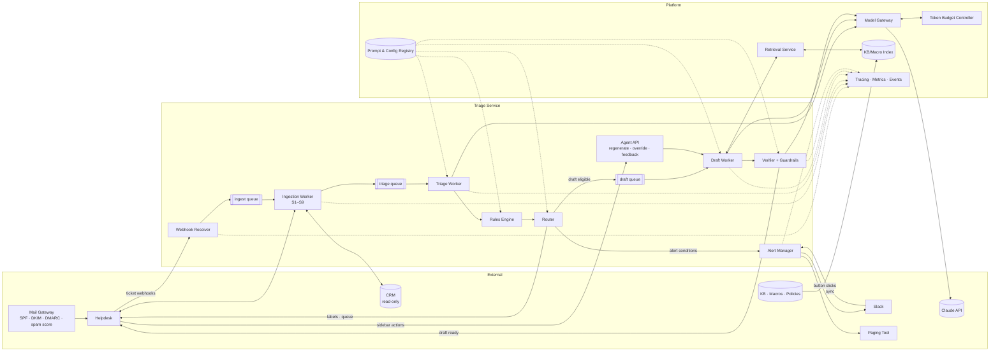
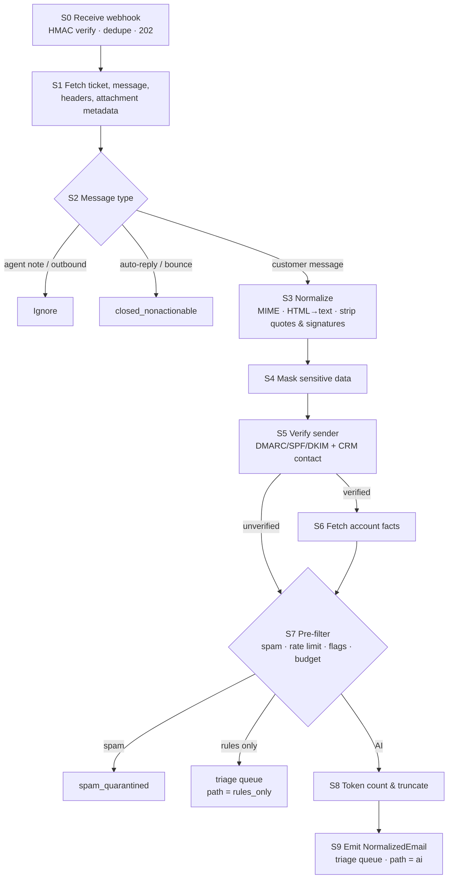
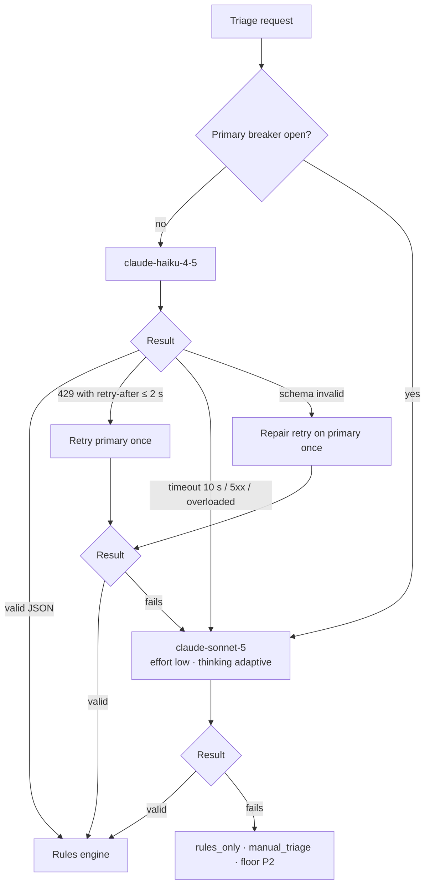

# ARCH: Customer Support Triage Agent

Feature architecture for the Customer Support Triage Agent. It maps how inbound support email is ingested and normalized, how context is assembled for each model call, and the exact conditions that route each email to models, queues, Slack channels, drafts, and fallbacks.

**How this document relates to others**

- **Requirements:** `archive/01_product_strategy/PRD_customer_support_triage.md` (PRD-2026-001). The PRD says *what* and *why*; this document says *how*. If the two disagree, the PRD wins and this document gets fixed.
- **Reference architecture:** `ARCHITECTURE_BLUEPRINT.md`. This design reuses the platform components it defines (model gateway, token budget controller, prompt registry, eval harness) and only documents what is specific to this feature.
- **Section map to the blueprint:**

| This Doc | Blueprint |
|---|---|
| §3 Mail Ingestion & Data Pipelines | §3 Data Pipelines |
| §4 Context Assembly per Route | §4 LLM Context Strategy |
| §5 API Routing Conditions | §5.5 Model Routing, §5.6 Degradation Ladder, §6 Reliability |
| §6 Service Interfaces & Schemas | §2.2 Components, §10 ADRs |
| §7 Token Budget Controls | §5 Token Budget Management Controls |
| §8–§10 Reliability, Security, Observability | §6–§8 |
| §11 Evaluation Hooks | §9 Evaluation Infrastructure |

---

## 0. Document Control

| Field | Value |
|---|---|
| Design ID | ARCH-customer-support-triage |
| Status | **Superseded** by `ARCH_support_triage_bot.md` (2026-09-15). Kept for reference; don't build from this document. |
| Linked PRD | PRD-2026-002 (`01_product_strategy/PRD_support_triage_bot.md`). **This design was written for superseded PRD-2026-001.** Before build, §5.2 and §5.7 must be updated for the new routing matrix (R1–R12), along with triage escalation, account resolution, and tier-based degradation (PRD-2026-002 OQ-2). |
| Authors | [Name, Engineering Lead] · [Name, Applied AI Lead] |
| Reviewers | [Eng] · [ML] · [Security] · [SRE] · [FinOps] · [Support Ops] |
| Last Updated | 2026-09-15 |

**Model note:** The original request specified Claude 3.5 Haiku and Claude 3.5 Sonnet. Both are retired and can't be called, so this design uses **Claude Haiku 4.5** (`claude-haiku-4-5`) for triage and verification, and **Claude Sonnet 5** (`claude-sonnet-5`) for drafting. See ADR-0002 and PRD OQ-1.

---

## 1. Scope & Key Design Decisions

**In scope (v1):** inbound email on support mailboxes → normalization → AI triage → rules → queue routing → Slack alerts → grounded draft replies in the agent workspace → feedback capture.

**Out of scope (v1):** sending email (the service has no send permission), attachments content, chat/phone channels, account actions, auto-send.

| # | Decision | Why |
|---|---|---|
| D1 | **Fixed workflow, not an autonomous agent.** Code runs every step; each model call is a single request with no tools. | Predictable, testable, cheap; the main attack surface is untrusted email, so the model should hold no capabilities. |
| D2 | **Models return JSON only; code performs every side effect** (helpdesk writes, Slack posts, pages). | A manipulated model output can at worst mislabel a ticket, which rules and humans catch. |
| D3 | **Rules run after the model and can only raise priority.** | Known critical signals (security, legal, Enterprise complaints) never depend on model accuracy alone. |
| D4 | **Account data is fetched only for verified senders.** | Prevents spoofed emails from pulling another customer's data into a draft. |
| D5 | **Ingestion is event-driven and idempotent**, with per-ticket ordering. | Helpdesk webhooks can be duplicated or arrive out of order. |
| D6 | **One async pipeline for triage, a separate queue for drafting.** | A slow draft never delays a P1 alert. |
| D7 | **Shadow mode is a first-class run mode**, not a separate deployment. | Same code path in shadow and live; Phase 1 results predict production. |

---

## 2. System Overview

### 2.1 Architecture Diagram



### 2.2 Component Responsibilities

| Component | Responsibility | Scales On | Stateful? |
|---|---|---|---|
| Webhook Receiver | Verify HMAC signature, dedupe, acknowledge within 2 s, enqueue | Request rate | No (dedupe store is external) |
| Ingestion Worker | Pipeline stages S1–S9 (§3.2): fetch, classify message type, normalize, mask, verify sender, fetch account facts, pre-filter, token-count | Ingest queue depth | No |
| Triage Worker | Build triage prompt, call model via gateway, validate schema, apply model fallback routing (§5.2) | Triage queue depth | No |
| Rules Engine | Priority floors, safety flags, confidence gates (§5.3) | CPU (in-process library) | No; rules loaded from registry |
| Router | Decide queue, Slack alert, and draft eligibility (§5.4–§5.6); write labels to helpdesk | Triage throughput | No |
| Alert Manager | Post, thread, dedupe, and digest Slack alerts; handle Claim / Not urgent; escalate unclaimed P1 to paging (§5.5) | Alert rate | Yes: alert state store (ticket ↔ Slack thread, claim status) |
| Draft Worker | Retrieval, draft prompt assembly, model call, draft model fallback (§5.7) | Draft queue depth | No |
| Verifier + Guardrails | Schema, source-ID, commitment, PII, and banned-phrase checks; Haiku verifier call (§5.8) | Draft throughput | No |
| Agent API | Regenerate (streaming), override, feedback, draft retrieval for sidebar app | Agent request rate | No |

### 2.3 Email Lifecycle States

```text
received ─► normalized ─► ┬─► closed_nonactionable        (auto-reply, bounce)
                          ├─► spam_quarantined             (spam pre-filter)
                          ├─► triaged_rules_only ──┐       (limits, kill switch, outage)
                          └─► triaged_ai ──────────┤
                                                   ▼
                                               routed ─► ┬─► alerted ─► claimed | escalated_to_page
                                                         ├─► draft_pending ─► draft_ready | draft_withheld | draft_failed
                                                         └─► no_draft (ineligible, reason recorded)
```

Every state change emits an event (§6.4) with `ticket_id`, `message_id`, `trace_id`, `run_mode` (`live` | `shadow`), and config versions.

---

## 3. Mail Ingestion & Data Pipelines

### 3.1 Pipeline Inventory

| Pipeline | Mode | Trigger | Freshness SLA | Output | Owner |
|---|---|---|---|---|---|
| Mail ingestion (§3.2) | Event-driven | Helpdesk `ticket.created`, `ticket.message_added` webhooks | Receipt → `normalized` ≤ 40 s p95 | `NormalizedEmail` record on triage queue | Support Tooling |
| KB, macro & policy indexing (§3.3) | Webhook + scheduled sync | KB publish webhook; macros hourly; policies on merge; nightly full reconcile | ≤ 1 hr from publish | Chunks + embeddings + keyword index | AI Platform |
| Feedback & overrides (§11) | Streaming | Sidebar and Slack interaction events | ≤ 15 min | Labeled interaction records → weekly eval candidates | Product Analytics |
| Usage & cost metering (§7) | Streaming | Every model call | ≤ 5 min | Cost ledger rows with feature/route tags | AI Platform |
| Outage backlog re-triage (§8.3) | On recovery | Circuit breaker closes after tickets took the rules-only path | Re-triaged ≤ 30 min after recovery | Updated labels; late alerts if priority rises | Support Tooling |
| Deletion propagation (§3.5) | Event-driven | Privacy deletion request | ≤ 72 hrs | Purged traces, logs, alert messages, eval candidates | Privacy Eng |

### 3.2 Mail Ingestion Pipeline



**Stage specifications**

| Stage | Input → Output | Rules | Timeout / Retries | Failure Behavior |
|---|---|---|---|---|
| **S0 Receive** | Webhook → ingest job | Verify `X-Helpdesk-Signature` (HMAC-SHA256, shared secret, 5-min timestamp tolerance). Idempotency key = `ticket_id:message_id`; duplicates within 7 days acknowledged and dropped. Respond `202` before any processing. | 2 s | Invalid signature → `401`, security log. Enqueue failure → `503` so the helpdesk retries. |
| **S1 Fetch** | Job → raw message | Fetch message, thread metadata, raw headers, and attachment names/types (not content). Jobs for the same `ticket_id` are processed in order (partitioned queue). | 5 s; 3 retries, exponential backoff | After retries → dead-letter queue (DLQ) + ticket tagged `triage_ingest_failed` → manual triage view |
| **S2 Classify message type** | Raw message → type | **Auto-reply/bounce** if any: `Auto-Submitted` ≠ `no`; `X-Autoreply` or `X-Autorespond` present; `Precedence: bulk \| junk \| auto_reply`; empty `Return-Path`; delivery-status MIME type. **Mailing list** if `List-Id` present and sender not a CRM contact. **Agent/outbound** if author is internal. **New ticket** vs **follow-up** from helpdesk event type. | — | Unknown → treat as customer message |
| **S3 Normalize** | Raw → clean text | Prefer `text/plain`; else convert `text/html` (drop script/style/images, keep link text + URL domain). Decode to UTF-8. Strip quoted history (`>` lines, "On … wrote:" blocks, Outlook header blocks, forwarded-message separators). Strip signatures (`-- ` delimiter, trailing contact blocks). Prior context comes from the helpdesk thread API (last 2 customer/agent messages), never from quoted text. | 1 s | Parse failure → keep raw text with HTML tags removed; set `normalization_degraded` |
| **S4 Mask** | Clean text → masked text | Replace with typed tokens: card numbers (13–19 digits, Luhn-valid) → `[CARD_NUMBER]`; IBAN/account numbers → `[BANK_ACCOUNT]`; values next to "password", "passcode", "OTP", "verification code" → `[SECRET]`; known API key prefixes and high-entropy tokens ≥ 32 chars → `[API_KEY]`; national ID patterns per supported country → `[GOV_ID]`. Record counts per type only, never values. | 500 ms | Masker error → **stop**; route `rules_only` and flag. Unmasked text never reaches a model. |
| **S5 Verify sender** | Headers + From → `sender_status` | Parse `Authentication-Results` from the mail gateway. `domain_verified` = DMARC `pass`, or (SPF `pass` AND DKIM `pass`, both aligned with From domain). `verified_account` = `domain_verified` AND exact From address matches an active CRM contact. Otherwise `unverified`. | CRM lookup 2 s | CRM timeout → `unverified` (fail closed) |
| **S6 Fetch account facts** | `verified_account` → `AccountFacts` | Read allowlisted fields only: `account_id`, `tier`, `plan`, `arr_band`, `region`, `renewal_date`, `open_ticket_count`, `account_owner`. Cache per account 10 min. | 2 s; 1 retry | Missing → continue without facts; tier-based rules don't fire; `account_facts_missing` flag |
| **S7 Pre-filter** | Record → path | See routing table §5.1 (spam, rate limit, kill switch, budget, circuit breaker). | — | — |
| **S8 Token count & truncate** | Masked text → sized payload | Local token estimate; if estimate > 80% of the route cap, confirm with the Claude token-counting endpoint. Latest message capped at 8,000 tokens: keep first 6,000 + last 2,000 with `[… N tokens omitted …]` marker. Prior messages capped at 3,000 tokens total, newest first. | Count call 1 s | Count call fails → use local estimate × 1.2 safety factor |
| **S9 Emit** | → `NormalizedEmail` | Publish to triage queue with `path`, `trace_id`, config versions, `run_mode`. | — | Publish failure → retry; then DLQ |

**`NormalizedEmail` record** (`schemas/normalized_email.v1.json`)

```json
{
  "ticket_id": "string",
  "message_id": "string",
  "event_type": "ticket.created | ticket.message_added",
  "received_at": "RFC 3339 timestamp",
  "run_mode": "live | shadow",
  "path": "ai | rules_only",
  "path_reason": "null | rate_limited | kill_switch | budget_cap | circuit_open | masker_error",
  "subject": "string (masked)",
  "latest_message": "string (masked, normalized, possibly truncated)",
  "prior_messages": [{ "author_role": "customer | agent", "text": "string (masked)", "sent_at": "timestamp" }],
  "truncated": false,
  "language_hint": "ISO 639-1 from gateway or null",
  "sender_status": "verified_account | domain_verified | unverified",
  "account_facts": { "account_id": "string", "tier": "enterprise | business | self_serve", "plan": "string", "arr_band": "string", "region": "string", "renewal_date": "date", "open_ticket_count": 0, "account_owner": "string" },
  "attachments": [{ "filename": "string", "content_type": "string" }],
  "masking_counts": { "CARD_NUMBER": 0, "BANK_ACCOUNT": 0, "SECRET": 0, "API_KEY": 0, "GOV_ID": 0 },
  "flags": ["normalization_degraded", "account_facts_missing"],
  "prior_triage": { "category": "string", "priority": "P1-P4", "triaged_at": "timestamp" },
  "config_versions": { "pipeline": "string", "masking_rules": "string" }
}
```

`account_facts` is `null` unless `sender_status` = `verified_account`. `prior_triage` is present only for follow-up messages.

### 3.3 KB, Macro & Policy Indexing

| Source | Trigger | Chunking | Metadata on Every Chunk | Notes |
|---|---|---|---|---|
| KB articles | Publish/unpublish webhook + nightly reconcile | Split on headings; 400–800 tokens; 10% overlap; heading path prepended | `source_id`, `source_type: kb`, `title`, `url`, `language`, `product_area`, `updated_at`, `visibility: public` | Internal-only articles are excluded from the draft index |
| Macros (approved reply templates) | Hourly sync | One macro per chunk | `source_id`, `source_type: macro`, `category`, `language`, `updated_at` | Also used by the T2 fallback (keyword match, no model) |
| Policy snippets (refunds, credits, SLAs, exceptions) | On merge to the policy repo (Support Ops owned) | One clause per chunk | `source_id`, `source_type: policy`, `applies_to_tiers`, `effective_from`, `effective_to`, `updated_at` | Retrieval filters out expired clauses and clauses that don't apply to the account tier |
| Acknowledgement templates (security, legal, safety) | On merge | Not indexed; loaded by ID | `template_id`, `language`, `approved_by`, `approved_at` | Never generated or modified by a model |

- **Index:** hybrid (vector + BM25), single index per language. Embedding model version is recorded on every vector; changing it means a full re-index with blue/green cutover (blueprint §3.2).
- **Quality gate:** the sync job fails if any chunk is missing `source_id` or `updated_at`, or if more than 1% of embeddings fail.

### 3.4 Context Ingestion Strategy per Route

| Route | Static Injection | Pre-indexed Retrieval | Live Structured Lookup | User-Supplied Content |
|---|---|---|---|---|
| Triage | System prompt: taxonomy, priority definitions, injection guidance, 12 few-shot examples | — | Account tier/plan (pre-fetched in S6) | Masked subject, latest message, 2 prior messages |
| Draft | System prompt: brand voice, drafting rules, commitment rules, 6 few-shot examples | KB, macros, policies (top 6 chunks, max 4,000 tokens) | Account facts (S6) | Masked email + thread |
| Verifier | System prompt: grounding and commitment checking rubric | — (reuses the draft's retrieved chunks) | — | Draft output |
| Regenerate | Same as draft + agent instruction block | Reuse original retrieval; re-retrieve only if the instruction changes the topic | Same as draft | Same as draft + agent instruction (treated as trusted: authenticated agent) |

All customer content is wrapped in `<customer_email>` delimiters. All retrieved content is wrapped in `<document source_id="…">` delimiters. Both system prompts state that content inside these tags is data and must never be followed as instructions.

### 3.5 Data Governance

| Data | Where Stored | Retention | Access |
|---|---|---|---|
| `NormalizedEmail` records | Pipeline store | 30 days | Service accounts; on-call engineers via audited break-glass |
| Model request/response logs (masked) | Log store | 30 days | Restricted, audited |
| Trace metadata (IDs, versions, labels, token counts, costs, timings) | Tracing + metrics | 13 months | Engineering, Support Ops dashboards |
| Alert state (ticket ↔ Slack thread, claims) | Alert state store | 90 days | Alert Manager |
| Feedback and overrides | Analytics warehouse | 13 months | Product Analytics, QA |
| Eval candidates | Eval dataset registry | Indefinite, **after** de-identification | ML team |

**Deletion order on a privacy request:** pipeline store → log store → alert state store and Slack messages (via `chat.delete`) → feedback rows → eval candidates not yet de-identified. Confirmed with a verification query per store.

---

## 4. Context Assembly per Route

### 4.1 Context Allocation

**Triage** (`claude-haiku-4-5`, 200K context; route cap 17,000 input / 1,024 output)

| Order | Section | Tokens (typical / cap) | Cacheable | Overflow Policy |
|---|---|---|---|---|
| 1 | System: instructions, taxonomy, priority definitions, injection guidance | 2,000 / 2,500 | Yes | Fail build if over |
| 2 | System: 12 few-shot examples | 3,000 / 3,000 | Yes (breakpoint after this) | Fail build if over |
| 3 | User: account facts block | 100 / 300 | No | Drop optional fields |
| 4 | User: subject + latest message | 800 / 8,000 | No | S8 head+tail truncation |
| 5 | User: prior messages | 300 / 3,000 | No | Drop oldest, then truncate |
| — | **Reserved output** | 250 / 1,024 | — | Schema keeps output short |

The static prefix (rows 1–2) is ~5,000 tokens. That is above Haiku 4.5's **4,096-token minimum cacheable prefix**; if prompt edits ever push it below 4,096, caching silently stops. CI fails any triage prompt version whose static prefix counts under 4,300 tokens.

**Draft** (`claude-sonnet-5`, 1M context; route cap 20,000 input (22,000 for regenerate) / 4,000 output)

| Order | Section | Tokens (typical / cap) | Cacheable | Overflow Policy |
|---|---|---|---|---|
| 1 | System: brand voice, drafting rules, commitment rules, output guidance | 1,500 / 2,000 | Yes | Fail build if over |
| 2 | System: 6 few-shot examples | 1,500 / 2,000 | Yes (breakpoint after this) | Fail build if over |
| 3 | User: triage result + account facts | 300 / 500 | No | Drop optional fields |
| 4 | User: retrieved documents | 3,000 / 4,000 | No | Drop below-threshold chunks → reduce top-k 6 → 4 → 3 |
| 5 | User: thread (prior messages) | 700 / 3,000 | No | Drop oldest |
| 6 | User: latest message | 800 / 8,000 | No | Never truncated beyond S8 |
| 7 | User: agent instruction (regenerate only) | 50 / 300 | No | Reject over 300 tokens in the UI |
| — | **Reserved output** (thinking + JSON) | ~1,000 / 4,000 | — | Effort `low` |

**Verifier** (`claude-haiku-4-5`; route cap 16,000 input / 512 output): system rubric (~1,500 tokens, below Haiku's caching minimum, so not cached) + retrieved documents + draft JSON.

### 4.2 Retrieval Configuration (`retrieval_config: draft@1`)

| Parameter | Value | Tuned By |
|---|---|---|
| Query | Triage `summary` + `customer_requests` + subject (not the raw email, which reduces injection influence on retrieval) | Retrieval evals |
| Filters (inside index query) | `language` = triage language; `visibility` = public; policy chunks: `applies_to_tiers` ∋ account tier AND effective today | Fixed |
| Candidates | `k_vector` = 20, `k_keyword` = 20, reciprocal rank fusion | Recall@20 ≥ 90% |
| Rerank | Cross-encoder, keep top 10 | MRR |
| Selection | `final_k` = 6, `min_score` from calibration, max 2 chunks per source | Groundedness eval |
| Empty result | Pass `<retrieved_documents status="none"/>`; prompt requires clarifying questions or `no_draft_reason: insufficient_context` | PRD §14.2 |

### 4.3 Prompt Caching Layout

| Route | Breakpoint | TTL | Expected Hit Rate | Notes |
|---|---|---|---|---|
| Triage | End of system few-shots | 5 min | ≥ 90% | Average gap between emails ≈ 50 s at 50,000/month; overnight gaps can exceed 5 min, so workers send a `max_tokens: 0` pre-warm request on boot and after deploys |
| Draft | End of system few-shots | 5 min | ≥ 90% | Prefix ~3,000 tokens clears Sonnet 5's 1,024-token minimum |
| Verifier | None | — | — | Prefix under Haiku minimum; revisit if the rubric grows past 4,096 tokens |

**Cache hygiene rules:** no timestamps, ticket IDs, or agent names in system prompts; few-shot examples in fixed order; prompt versions change only through the registry. Caches are isolated per API workspace, so all live triage traffic uses one workspace. Alert fires when a route's `cache_read_input_tokens` share drops below 70% for 1 hour.

### 4.4 Model Request Configuration

Parameters shown are Claude Messages API request fields, set by the Triage and Draft Workers through the model gateway.

| Setting | Triage | Draft | Regenerate | Verifier |
|---|---|---|---|---|
| `model` | `claude-haiku-4-5` | `claude-sonnet-5` | `claude-sonnet-5` | `claude-haiku-4-5` |
| `max_tokens` | 1,024 (2,000 on the Sonnet 5 fallback, which uses adaptive thinking at effort `low`) | 4,000 | 4,000 | 512 |
| `output_config.format` | JSON schema `triage_output.v1` | JSON schema `draft_output.v1` | JSON schema `draft_output.v1` | JSON schema `verifier_output.v1` |
| Thinking | Off (parameter omitted) | `{type: "adaptive"}` | `{type: "adaptive"}` | Off |
| `output_config.effort` | Not supported on Haiku 4.5 | `low` | `low` | Not supported |
| `temperature` | 0 | Not set (rejected on Sonnet 5) | Not set | 0 |
| Streaming | No | No | Yes (to sidebar via SSE) | No |
| Client timeout | 10 s | 60 s | 45 s | 10 s |
| SDK auto-retries | Disabled (router handles retries, §5.2) | Disabled | Disabled | Disabled |

**Check before every model call:** a route config missing `max_tokens` or a timeout is rejected by the gateway (blueprint §5.8 E1). Before build, all model IDs are confirmed with the Models API, and structured outputs are validated against each schema with a smoke test.

---

## 5. API Routing Conditions

Conditions are evaluated **in the order listed**, and the first match wins unless the table says otherwise. All thresholds live in the config registry (`routing_config: triage@1`) and change only through reviewed config releases (PRD §10.4).

### 5.1 Pipeline Path (S7 Pre-filter)

| # | Condition | Path | Model Call? | Ticket Effect |
|---|---|---|---|---|
| P0 | S2 classified auto-reply, bounce, or mailing list | `closed_nonactionable` | No | Tag `auto_reply`; close per existing helpdesk rule |
| P1 | Gateway spam score ≥ `spam_threshold` (default 8.0) AND sender is not a CRM contact | `spam_quarantined` | No | Move to spam view; 2% daily audit sample |
| P2 | Masker error in S4 | `rules_only` (`masker_error`) | No | Flag for engineering |
| P3 | `triage_ai_enabled` = false | `rules_only` (`kill_switch`) | No | Banner shown in workspace |
| P4 | Sender sent > 10 emails in the last hour (or domain > 200) | `rules_only` (`rate_limited`) | No | One digest alert per sender per hour |
| P5 | Triage daily **hard** budget reached | `rules_only` (`budget_cap`) | No | Budget owner paged |
| P6 | Triage circuit breakers open for **both** primary and fallback models | `rules_only` (`circuit_open`) | No | Backlog re-triage on recovery (§8.3) |
| P7 | Otherwise | `ai` | Yes | — |

**Rules-only classifier:** keyword and sender-signal rules (maintained by Support Ops) assign category where confident, otherwise `other`. Priority = highest applicable rule floor (§5.3), minimum **P2** for any customer email. The ticket goes to `manual_triage` unless a rule matched category with high confidence.

### 5.2 Triage Model Routing



| Condition | Action | Metric / Event |
|---|---|---|
| HTTP 200 + schema-valid JSON | Continue to rules | `triage.completed{model}` |
| HTTP 429 with `retry-after` ≤ 2 s | Retry primary once after the delay | `model.retry{reason=rate_limit}` |
| HTTP 429 with `retry-after` > 2 s, 5xx, overloaded, or 10 s timeout | Route to fallback model | `fallback.timeout` / `fallback.outage` |
| Response fails schema validation or enum checks (should be rare with structured outputs) | One repair retry on primary, then fallback | `model.schema_invalid` |
| HTTP 400 (invalid request) | No retry; `rules_only`; page AI Platform (likely a config bug) | `model.bad_request` |
| Fallback also fails | `rules_only`, `manual_triage`, floor P2 | `fallback.outage` |
| **Circuit breaker (per model)** | Opens when ≥ 20 requests in 60 s AND error rate ≥ 20%. Half-open after 30 s with 5 probe requests; closes if ≥ 4 succeed. | `breaker.state{model}` |
| Fallback volume > 10% of triage traffic for 15 min | Alert FinOps + AI Platform (fallback costs ~2× per email) | `fallback.rate` |

### 5.3 Priority & Confidence Resolution (Rules Engine)

Runs on every triage result, including rules-only results.

**Step 1: Safety and security floors** (evaluated first, all that match apply)

| Rule ID | Condition | Effect |
|---|---|---|
| RL-SAFE-1 | Safety keyword/moderation match (self-harm, threats of violence) | `safety_flag` = true; priority = P1; route Trust & Safety queue; **no draft** |
| RL-SEC-1 | Security keyword match (e.g., "vulnerability", "data breach", "exposed data", "hacked") AND `sender_status` ≠ `unverified` | Priority ≥ P1; category = `security_privacy` |
| RL-SEC-2 | Security keyword match AND `unverified` | Priority ≥ P2; category review flag (spoofed security reports are a known phishing pattern) |
| RL-LEGAL-1 | Legal keyword match ("lawyer", "attorney", "legal action", "subpoena", "regulator", "GDPR request", "data subject request") | Priority ≥ P2; category review flag; if model category = `legal_compliance`, priority ≥ P1 for Enterprise tier |

**Step 2: Business floors**

| Rule ID | Condition | Effect |
|---|---|---|
| RL-ENT-1 | `tier` = enterprise AND `is_complaint` = true | Priority ≥ P2 |
| RL-ENT-2 | `tier` = enterprise AND `churn_risk` = high AND `renewal_date` within 60 days | Priority ≥ P1 |
| RL-BILL-1 | Keyword "chargeback" or "dispute with my bank" | Priority ≥ P2; category review flag if model category ≠ `billing` |
| RL-REPEAT-1 | Third customer message on the ticket within 72 hrs and ticket unresolved | Raise priority one level (max P1) |
| RL-FOLLOWUP-1 | Follow-up message: `prior_triage.priority` exists | Priority ≥ prior priority. Follow-ups never lower priority; only an agent can downgrade. |

**Step 3: Resolve**

```text
final_priority   = max(model_priority, all matched floors)            # P1 > P2 > P3 > P4
final_category   = model_category, unless a rule set category explicitly
needs_review     = category_confidence < θ_category                   # initial θ = 0.70, set by calibration
                   OR priority_confidence < θ_priority                # initial θ = 0.75
                   OR any rule set "category review flag"
if needs_review:
    queue          = manual_triage
    final_priority = max(final_priority, P2)
```

**Step 4: Record** `rules_applied[]`, `model_priority`, `final_priority`, and thresholds version on the ticket and in the trace. Rules **never** lower priority (unit-tested, PRD §10.1).

### 5.4 Queue Routing

First matching row wins.

| # | Condition | Queue | SLA Policy |
|---|---|---|---|
| Q1 | `safety_flag` = true | `trust_safety` | P1 |
| Q2 | `final_category` = `security_privacy` | `security_intake` | Per priority |
| Q3 | `final_category` = `legal_compliance` | `legal_privacy_intake` | Per priority |
| Q4 | `needs_review` = true OR path = `rules_only` without a confident rule category | `manual_triage` | P2 minimum |
| Q5 | `language` ∉ {en, es, fr, de} | `lang_<code>` if it exists, else `lang_other` | Per priority |
| Q6 | `tier` = enterprise | `enterprise_<category>` | Enterprise SLA |
| Q7 | `final_category` ∈ {`billing`, `cancellation`} | `billing_retention` | Per priority |
| Q8 | `final_category` = `technical_issue` | `technical_<language>` | Per priority |
| Q9 | `final_category` = `feature_request` | `product_feedback` (tag only; no reply SLA beyond P4) | P4 |
| Q10 | Otherwise | `general_<language>` | Per priority |

Labels written to helpdesk custom fields: `ai_category`, `ai_secondary_category`, `ai_priority`, `final_priority`, `ai_sentiment`, `ai_churn_risk`, `ai_language`, `ai_summary`, `ai_confidence_band` (High / Review / Low), `rules_applied`, `triage_path`, `triage_trace_id`. In **shadow mode** nothing is written; results go to the shadow store only.

### 5.5 Slack Alert Routing

**Alert conditions** (all matching rows post; one message per channel)

| # | Condition | Channel | Mention |
|---|---|---|---|
| A1 | `final_priority` = P1 AND category ∉ {`security_privacy`, `legal_compliance`} AND NOT `safety_flag` | `#support-p1-escalations` | `@support-escalation-oncall` |
| A2 | category = `security_privacy` AND `final_priority` ∈ {P1, P2} | `#security-incident-intake` | `@security-oncall` |
| A3 | category = `legal_compliance` AND `final_priority` ∈ {P1, P2} | `#legal-support-intake` (private) | `@legal-oncall` |
| A4 | `final_priority` = P2 AND `is_complaint` AND `tier` = enterprise (config flag, PRD OQ-2) | `#support-enterprise-escalations` | None |
| A5 | `final_priority` = P1 AND category = `billing` | Cross-post `#billing-escalations` | `@billing-lead` |
| A6 | `safety_flag` = true | `#trust-safety-urgent` (private) | `@trust-safety-oncall` |

**Suppression, threading, and escalation** (evaluated before posting)

| # | Condition | Behavior |
|---|---|---|
| S1 | `run_mode` = shadow OR `triage_slack_alerts_enabled` = false | Don't post. If alerts are disabled in live mode, send A1/A2/A6 alerts straight to the paging tool. |
| S2 | An alert for this `ticket_id` exists in the channel within 30 min | Reply in the existing thread ("Updated: new message, priority P1") instead of a new message |
| S3 | > 20 A1 alerts in the last 10 min | Switch channel to digest mode: one message every 5 min listing tickets; page on-call once |
| S4 | ≥ 5 P1 `technical_issue` tickets in 15 min whose summary embeddings have cosine similarity ≥ 0.85 to each other | Post one "Possible incident" message grouping them; page on-call |
| S5 | Sender already produced a digest alert this hour (rate-limited sender) | Don't post; append to the digest |
| S6 | A1 or A2 alert unclaimed after 15 min | Page the channel's on-call; post "Escalated to on-call" in thread |
| S7 | `chat.postMessage` fails 3 times (backoff 2 s, 8 s, 30 s) | Page on-call with ticket link; tag ticket `slack_alert_failed`; re-post when Slack recovers |

**Interaction handling** (`POST /v1/slack/interactions`): verify Slack request signature and timestamp; **Claim** → assign ticket to the Slack user's mapped helpdesk user (reject if no mapping) and update the message; **Not urgent** → record `alert.not_urgent`, don't change priority (agent must change priority in the helpdesk), and add the ticket to eval candidates.

### 5.6 Draft Eligibility

A draft job is enqueued only if **every** condition is true. The first failing condition becomes `no_draft_reason`.

| # | Condition | If False → `no_draft_reason` | Fallback Shown to Agent |
|---|---|---|---|
| E1 | `run_mode` = live OR shadow drafting enabled | — (shadow drafts go to shadow store) | — |
| E2 | `triage_drafts_enabled` = true AND `triage_drafts_enabled.<category>` = true | `drafts_disabled` | Suggested macros (keyword match) |
| E3 | `safety_flag` = false | `safety` | Safety runbook link |
| E4 | category ∉ {`security_privacy`, `legal_compliance`} | `sensitive_topic` | Approved acknowledgement template by ID (no model call) |
| E5 | category ≠ `spam` AND path ≠ `closed_nonactionable` | `non_actionable` | None |
| E6 | `injection_suspected` = false | `injection_suspected` | Warning banner (PRD §14.2) |
| E7 | `sender_status` = `verified_account` | `unverified_sender` | Identity verification macro |
| E8 | `language` ∈ {en, es, fr, de} | `unsupported_language` | None |
| E9 | Drafting budget below soft cap (§7.2) | `budget_paused` | Suggested macros |
| E10 | Draft breakers not open for both draft models, or category is Haiku-fallback-eligible | `model_unavailable` | Suggested macros |
| E11 | Ticket status is open and no agent reply was sent after this customer message | `already_answered` | None |

Eligible drafts are queued by priority: P1 jobs jump the draft queue, then P2, then P3/P4 in arrival order.

### 5.7 Draft Model Routing

| Condition | Action |
|---|---|
| Default | `claude-sonnet-5`, adaptive thinking, effort `low` |
| 429 with `retry-after` ≤ 5 s | Retry once after delay |
| Timeout (60 s), 5xx, overloaded, or breaker open | If category ∈ {`how_to`, `order_subscription`} AND `haiku_draft_fallback_enabled` (set only if bake-off passes, PRD §9.3) → `claude-haiku-4-5`. Else → `draft_failed`, suggested macros. |
| `stop_reason` = `max_tokens` (hit 4,000 cap) | Retry once with retrieval reduced to top 3 chunks; if still capped → `draft_failed` |
| Schema-invalid output | One repair retry, then `draft_failed` |
| Draft budget ≥ 90% of daily soft cap | Route `how_to` and `order_subscription` to Haiku (if enabled); others unchanged |

### 5.8 Verification & Draft Release

| Check | Implementation | Pass Condition | On Failure |
|---|---|---|---|
| Schema | JSON schema validation | Valid | Repair retry (§5.7) |
| Source IDs | Every `sources[].source_id` ∈ retrieved set | 100% | Remove unknown IDs; mark draft `unverified_sources` |
| Banned phrases | Config list per language ("we've refunded", "guarantee", "I'm a human", internal tool names) | 0 matches | Highlight; count as failed claim |
| PII | Scan for masked-token leakage, other customers' emails/names from retrieval, unmasked card/secret patterns | 0 matches | **Withhold** draft; security log |
| Commitment coverage | Deterministic keyword scan for commitment verbs vs. `commitments[]` | Every detected commitment listed | Add missing items to `commitments[]` so the agent must confirm them |
| Grounding & commitment verifier | `claude-haiku-4-5` returns per-sentence `supported` / `unsupported` / `commitment_unlisted` | 0 unsupported policy claims | 1–2 failures → release with highlights; > 2 → withhold (`draft_withheld`) |
| Verifier unavailable | Timeout 10 s or breaker open | — | Release with deterministic checks only and label "Not verified". Send still requires commitment confirmation. |

**Release:** the draft, sources, commitments, verification highlights, and trace ID are written to the sidebar app store and the ticket gets a `draft_ready` tag. The helpdesk's send action is gated by the sidebar app until every commitment is confirmed or removed (PRD FR-08).

### 5.9 Budget-Driven Degradation

| Budget State (per blueprint §5.6) | Triage | Drafting | Verifier |
|---|---|---|---|
| < 75% of window | Normal | Normal | Normal |
| ≥ 75% | Normal | `final_k` 6 → 4 | Normal |
| ≥ 90% | Normal | Haiku for eligible categories (§5.7); `final_k` 4 | Deterministic checks only for `how_to` |
| ≥ 100% drafting soft cap | Normal | Paused (E9); macros only | Off |
| Triage hard cap | `rules_only` (P5) | Paused | Off |

---

## 6. Service Interfaces & Schemas

### 6.1 Inbound Interfaces

| Endpoint | Caller | Auth | Purpose | Response |
|---|---|---|---|---|
| `POST /v1/webhooks/helpdesk` | Helpdesk | HMAC signature + timestamp | `ticket.created`, `ticket.message_added`, `ticket.updated` (status, assignee) | `202` (enqueued) · `200` (duplicate) · `401` · `503` |
| `POST /v1/slack/interactions` | Slack | Slack signing secret | Claim, Not urgent buttons | `200` within 3 s; work done async |
| `GET /v1/tickets/{ticket_id}/assist` | Sidebar app | Helpdesk app token (agent identity) | Labels, rules applied, draft, sources, commitments, verification highlights | `200` · `404` · `202` (draft pending) |
| `POST /v1/tickets/{ticket_id}/drafts:regenerate` | Sidebar app | Agent token | Body: `{ "instruction": "string ≤ 300 tokens", "preset": "shorter \| more_empathetic \| ask_for_details \| null" }` | `text/event-stream`: `draft.delta`, then `draft.complete` with full JSON, then `verification.complete` |
| `POST /v1/tickets/{ticket_id}/triage:override` | Sidebar app | Agent token | Body: `{ "category": "...", "priority": "P1-P4", "reason": "string" }` | `200`; emits `triage.overridden` |
| `POST /v1/drafts/{draft_id}/feedback` | Sidebar app | Agent token | Body: `{ "rating": "up \| down", "reason": "wrong_facts \| wrong_tone \| missed_question \| unsafe_commitment \| other", "comment": "string" }` | `204` |
| `POST /v1/drafts/{draft_id}/events` | Sidebar app | Agent token | `inserted`, `discarded{reason}`, `commitment_confirmed{index}`, `sent{edit_distance}` | `204` |
| `POST /v1/admin/tickets/{ticket_id}:retriage` | Support Ops tooling | SSO + `triage-admin` role | Re-run triage with current config | `202` |

### 6.2 Outbound Dependencies

| Dependency | Operations Used | Service Account Scope | Timeout | Rate Limit Handling |
|---|---|---|---|---|
| Helpdesk API | Read ticket/messages/headers; write custom fields; set queue; add tags; sidebar app data | Read tickets; write fields, tags, queue. **No permission to send email or change customer records.** | 5 s | Token bucket at 80% of vendor limit; queue backpressure |
| CRM API | Read contact by email; read account allowlisted fields | Read-only, field allowlist | 2 s | 10-min cache; circuit breaker |
| Claude API (via Model Gateway) | Messages (triage, draft, verifier, regenerate); token counting; Message Batches (evals, backfills) | Gateway-held key; per-route budget tags | Per route (§4.4) | Router-managed retries (§5.2, §5.7); gateway tracks rate-limit headers |
| Retrieval Service | Hybrid search + rerank | Internal mTLS | 1.5 s | — |
| Slack Web API | `chat.postMessage`, `chat.update`, `chat.delete` (privacy deletion) | Bot scopes limited to escalation channels | 5 s | Honor `Retry-After`; per-channel send queue |
| Paging tool | Create incident for on-call schedule | Integration key per schedule | 5 s | Retry 3×, then email fallback |

### 6.3 Schemas

Stored in `02_tech_architecture/schemas/` (folder to be created) and versioned with this design. Output schemas are copied verbatim from PRD §7.2.

| Schema | Used By | Notes |
|---|---|---|
| `normalized_email.v1.json` | S9 → Triage Worker | §3.2 |
| `triage_output.v1.json` | Triage model structured output | PRD §7.2; enums closed; `additionalProperties: false` |
| `draft_output.v1.json` | Draft model structured output | PRD §7.2; sources as structured `source_id` fields (API citations can't be combined with structured outputs) |
| `verifier_output.v1.json` | Verifier structured output | `{ "sentences": [{ "index": 0, "verdict": "supported \| unsupported \| commitment_unlisted", "source_id": "string or null" }] }` |
| `assist_response.v1.json` | `GET /assist` | Sidebar contract |
| `events.v1.json` | Event bus | §6.4 envelope + payloads |

### 6.4 Events

Envelope: `{ event_id, event_type, occurred_at, ticket_id, message_id, trace_id, run_mode, config_versions, payload }`.

| Event | Emitted When | Key Payload Fields |
|---|---|---|
| `email.received` | S0 accepted | `event_type`, `dedupe_hit` |
| `email.normalized` | S9 emitted | `path`, `path_reason`, `sender_status`, `truncated`, `masking_counts` |
| `triage.completed` | Rules resolved | `model`, `model_priority`, `final_priority`, `category`, `confidence`, `rules_applied`, `queue`, `tokens`, `cost_usd`, `latency_ms` |
| `triage.overridden` | Agent override | `old`, `new`, `reason`, `agent_id_hash` |
| `alert.posted` / `alert.threaded` / `alert.digested` | §5.5 | `channel`, `rule_ids` |
| `alert.claimed` / `alert.escalated` / `alert.not_urgent` | Slack interaction or timer | `seconds_since_post` |
| `draft.ready` / `draft.withheld` / `draft.failed` / `draft.skipped` | §5.6–§5.8 | `model`, `no_draft_reason`, `verification_summary`, `tokens`, `cost_usd`, `latency_ms` |
| `draft.inserted` / `draft.discarded` / `draft.sent` | Sidebar | `edit_distance`, `commitments_confirmed`, `discard_reason` |
| `fallback.<trigger>` | Any PRD §14.2 trigger | `route`, `from_model`, `to` |

---

## 7. Token Budget Controls

### 7.1 Budget Allocation

| Level | Budget | Window | Enforcement |
|---|---|---|---|
| Feature (all routes) | $2,500 | Month | Hard cap; alerts 50 / 75 / 90 / 100% |
| Feature daily | $150 soft / $250 hard | Day (UTC) | Soft → degradation ladder (§5.9); hard → triage `rules_only`, drafting paused |
| Route: triage (Haiku 4.5 + Sonnet 5 fallback) | $400 | Month | Hard cap → `rules_only` |
| Route: drafting + verifier + regenerate | $1,800 | Month | Soft cap → pause drafts (E9) |
| Route: evals + backfills (Message Batches, 50% discount) | $300 | Month | Hard cap; jobs wait for next window |
| Per agent: regenerations | 30 | Day | UI disables Regenerate with a notice |
| Per sender | 10 emails/hour → rules-only | Hour | §5.1 P4 |
| Staging / dev | $100 / $50 | Month | Hard caps, separate API keys (blueprint §5.8 E5) |

Planning estimate (PRD §16): about $165/month for triage and about $1,190/month for drafting and verification at 50,000 emails.

### 7.2 Per-Request Reservations

Admission control reserves the worst-case cost before each call and reconciles to metered usage afterwards (blueprint §5.8 E2). List prices as of 2026-09-15.

| Route | Worst-Case Reservation | Calculation |
|---|---|---|
| Triage | $0.0221 | 17,000 input × $1/1M + 1,024 output × $5/1M |
| Triage fallback (Sonnet 5) | $0.0540 | 17,000 × $2/1M + 2,000 output × $10/1M |
| Draft / regenerate | $0.0800 | 20,000 × $2/1M + 4,000 × $10/1M |
| Verifier | $0.0186 | 16,000 × $1/1M + 512 × $5/1M |

Reservations use uncached rates. Reconciliation credits back the difference, including cache savings.

### 7.3 Cost Attribution Tags

Every model call carries the blueprint §5.7 tags with: `feature: support_triage`, `route: triage | triage_fallback | draft | regenerate | verifier | eval | backfill`, `prompt_version`, `retrieval_config`, `routing_config`, `run_mode`, `ticket_priority`, `category`.

---

## 8. Reliability & Failure Handling

### 8.1 Queues & Delivery Guarantees

| Queue | Partition Key | Delivery | Max Attempts → DLQ | DLQ Handling |
|---|---|---|---|---|
| `ingest` | `ticket_id` | At-least-once, ordered per ticket | 5 | Ticket tagged `triage_ingest_failed` → manual triage; on-call alert if DLQ > 10 in 15 min |
| `triage` | `ticket_id` | At-least-once, ordered per ticket | 5 | `rules_only` result written; alert |
| `draft` | Priority-weighted | At-least-once | 3 | `draft.failed`; macros shown |
| `alerts` | `channel` | At-least-once, ordered per channel | 3 → page on-call (§5.5 S7) | Re-post on recovery |

**Idempotency:** helpdesk writes are keyed by `ticket_id:message_id:config_version` (a re-run with the same config doesn't write twice). Slack posts check the alert state store before posting. Draft jobs are keyed by `ticket_id:message_id`; a newer customer message cancels an older pending draft job.

### 8.2 SLOs

| SLI | SLO | Measured From |
|---|---|---|
| Receipt → labels written, p95 | ≤ 60 s | `email.received` → `triage.completed` |
| Receipt → Slack alert (A1/A2), p95 | ≤ 120 s | `email.received` → `alert.posted` |
| Receipt → draft ready, p95 | ≤ 90 s | `email.received` → `draft.ready` |
| Triage pipeline availability (incl. rules-only) | 99.9% monthly | Tickets with a `triage.completed` event within 5 min / all customer emails |
| AI-labeled triage share | ≥ 99.5% | `triage.completed{path=ai}` / all eligible |
| Draft availability (eligible tickets with `draft.ready`) | ≥ 99.0% | Draft events |

### 8.3 Outage Recovery

- **Backlog re-triage:** when a triage breaker closes, tickets routed `rules_only` with `path_reason` ∈ {`circuit_open`, `budget_cap`} in the last 24 hrs are re-triaged through the live API in priority order, at most 30% of normal capacity. Priority can only go **up** on re-triage (never downgrade a ticket an agent may already be working). If priority rises to P1, alerts fire as normal.
- **Message Batches are not used for backlog recovery**, because batch results can take much longer than the 30-minute recovery target. Batches are only for evals and non-urgent backfills.
- **Chaos tests before pilot:** Claude API 100% 5xx for 10 min; 429 storm; CRM down; Slack down; helpdesk webhook duplicates and reordering; masker exception; budget hard cap.

---

## 9. Security & Isolation

| Threat | Control | Verified By |
|---|---|---|
| Forged webhooks | HMAC signature + timestamp tolerance; IP allowlist where the vendor supports it | Unit tests; pen test |
| Forged Slack interactions | Slack signing secret verification; Slack-user → helpdesk-user mapping required for Claim | Unit tests |
| Prompt injection in email | Masked, delimited customer content; schema-only outputs; no model tools; injection flag → no draft; retrieval query built from triage summary, not raw email | Red-team suite in CI (PRD §10.1) |
| Spoofed sender extracting account data | Account facts only for `verified_account` (S5); draft requires E7 | Spoofing test cases |
| Draft leaks another customer's data | Context contains only the verified account's facts; retrieval index holds public KB content only; PII scan on output (§5.8) | Output scan metrics; QA sample |
| Service sends email or changes records if compromised | Helpdesk scope excludes send and customer-record writes; CRM read-only | Scope review in security sign-off |
| Secrets exposure | Webhook, Slack, CRM, and helpdesk credentials in secrets manager, rotated every 90 days; Claude API key held only by model gateway | Secret scanning; config audit |
| Sensitive data in Slack | Masked summary only, no email body; private channels for legal, safety, security | Alert payload tests |
| Log exposure | Masked content only; 30-day retention; audited access | Log access audit |
| Denial of wallet via email floods | Pre-filter before model calls; per-sender and per-domain limits; budget caps | Load test with synthetic flood |

---

## 10. Observability

### 10.1 Trace Spans

`webhook.receive` → `ingest.fetch` → `ingest.normalize` → `ingest.mask` → `ingest.verify_sender` → `ingest.account_facts` → `ingest.prefilter` → `ingest.token_count` → `triage.model_call{model, attempt}` → `rules.resolve` → `route.write_labels` → `alert.post{channel}` → `draft.retrieve` → `draft.model_call{model, attempt}` → `draft.verify` → `draft.release`

Each model call span records: input, cached-input, and output tokens; `stop_reason`; latency; TTFT (streaming only); cost; prompt version.

### 10.2 Dashboards & Alerts

| Metric | Alert Condition | Routes To |
|---|---|---|
| Receipt → alert p95 | > 120 s for 15 min | AI Platform on-call |
| Receipt → labels p95 | > 60 s for 15 min | AI Platform on-call |
| Triage fallback share | > 10% for 15 min | AI Platform + FinOps |
| `rules_only` share (excluding kill switch) | > 2% for 15 min | AI Platform on-call |
| Schema-invalid rate | > 0.5% for 15 min | AI Platform |
| Cache read share (triage, draft) | < 70% for 1 hr | AI Platform |
| DLQ depth (any queue) | > 10 in 15 min | Support Tooling on-call |
| Injection flag rate | > 3× 7-day baseline for 1 hr | Security |
| Slack alert failures | Any S7 page | Support Tooling on-call |
| Unclaimed P1 escalations | > 3 in 1 hr | Escalation manager lead |
| Draft withheld rate | > 5% for 24 hrs | ML Lead |
| Daily cost | Budget thresholds (§7.1) | Budget owner |

---

## 11. Evaluation Hooks

| Hook | Implementation |
|---|---|
| Shadow mode | `run_mode = shadow` set per mailbox in config. Pipeline runs fully; helpdesk writes, Slack posts, and paging are replaced by writes to the shadow store. Shadow results are joined with human triage labels nightly. |
| Golden set runner | Eval harness replays `NormalizedEmail` fixtures through Triage Worker, Rules Engine, Draft Worker, and Verifier with a pinned config bundle; LLM-as-judge grading on Message Batches |
| CI gates | On any change to prompts, schemas, routing/rules config, retrieval config, or model IDs: run rules unit tests (100%), triage and draft regression suites, red-team suite, and prompt-prefix token count check (§4.1) |
| Production sampling | 2% of AI-triaged tickets and 5% of released drafts scored asynchronously by the judge; failures sent to QA review |
| Feedback export | Weekly job: overrides, `alert.not_urgent`, discarded drafts, thumbs-down, QA failures → de-identification → eval candidate queue |
| Config bundles | `prompt_version` + `routing_config` + `rules_version` + `retrieval_config` + model IDs are released together as an immutable bundle; traces record the bundle ID |

---

## 12. Architecture Decision Records

Stored in `02_tech_architecture/adr/` (folder to be created), using the blueprint §10 template.

| ADR | Title | Status |
|---|---|---|
| ADR-0001 | Fixed workflow instead of an autonomous tool-using agent for v1 | Proposed |
| ADR-0002 | Claude Haiku 4.5 for triage and verification, Claude Sonnet 5 for drafting (replaces retired Claude 3.5 Haiku / 3.5 Sonnet from the original request) | Proposed (pending PRD OQ-1 and bake-off) |
| ADR-0003 | Deterministic rules after the model that can only raise priority | Proposed |
| ADR-0004 | Structured `source_id` fields instead of API citations for drafts | Proposed |
| ADR-0005 | Sender verification gate for account data and drafts | Proposed |
| ADR-0006 | Code-owned side effects; service has no email-send permission | Proposed |
| ADR-0007 | 5-minute prompt-cache TTL with pre-warm on worker boot | Proposed |
| ADR-0008 | Live API (not Message Batches) for outage backlog re-triage | Proposed |

---

## 13. Readiness Checklist

**Ingestion**
- [ ] Webhook signature verification, dedupe, and per-ticket ordering tested with duplicate and out-of-order events
- [ ] Auto-reply/bounce detection validated on 1,000 historical messages (≥ 99% precision)
- [ ] Masking validated on a seeded test set (≥ 99.5% recall for card numbers and secrets); masker failure routes `rules_only`
- [ ] Sender verification confirmed against real gateway `Authentication-Results` headers (dependency: mail gateway team)
- [ ] KB, macro, and policy indexes live, with freshness ≤ 1 hr monitored

**Context & Models**
- [ ] Triage static prefix ≥ 4,300 tokens (CI check) and cache hits confirmed in shadow mode
- [ ] Model IDs confirmed via Models API; structured outputs smoke-tested against all schemas
- [ ] Request configuration (§4.4) matches PRD §9.4 and passed bake-off

**Routing**
- [ ] Every condition in §5.1–§5.9 covered by unit tests, including ordering and first-match behavior
- [ ] Rules never lower priority (property-based test)
- [ ] Slack suppression, threading, digest, incident clustering, and unclaimed escalation tested end to end in staging
- [ ] Draft eligibility reasons recorded for 100% of non-drafted tickets

**Budget, Reliability & Security**
- [ ] Route budgets and reservations configured; hard caps tested in staging
- [ ] Chaos tests in §8.3 passed; backlog re-triage meets 30-min target
- [ ] Helpdesk and CRM service account scopes reviewed (no send permission)
- [ ] Red-team and spoofing suites pass; threat model signed off

**Observability & Evaluation**
- [ ] All spans, events, dashboards, and alerts in §6.4 and §10 live before shadow mode
- [ ] Shadow mode verified to produce zero helpdesk writes, Slack posts, or pages
- [ ] CI gates in §11 block releases on failure
